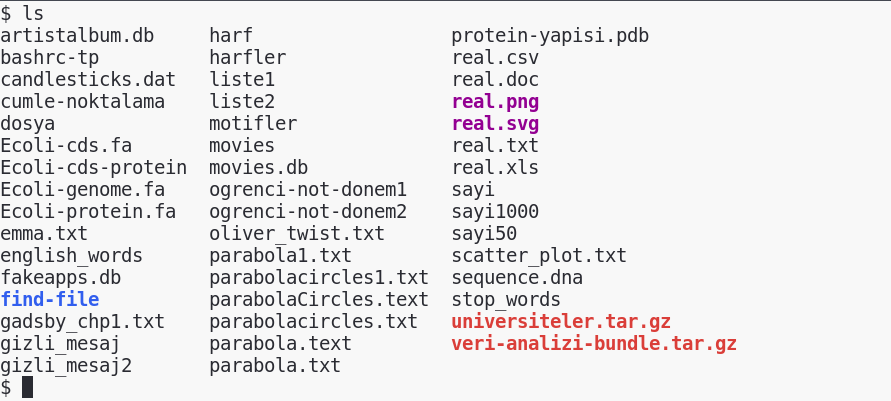
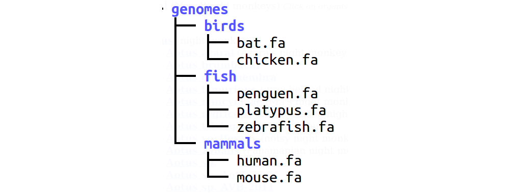
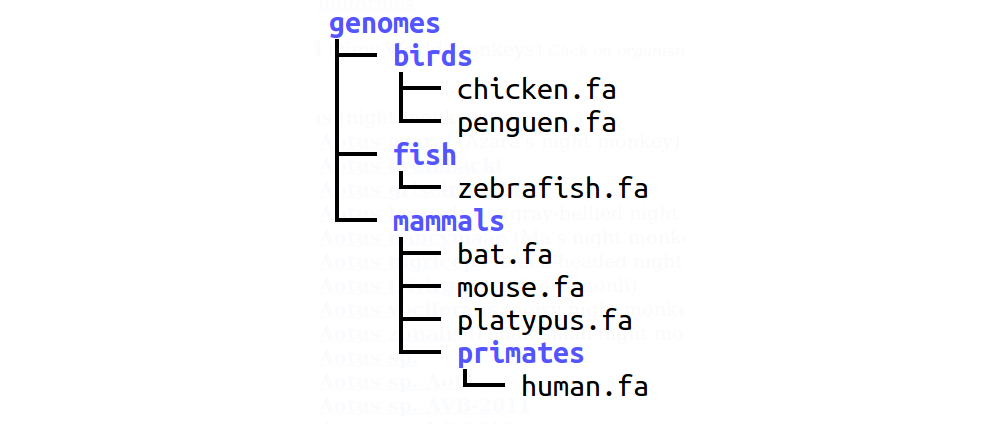
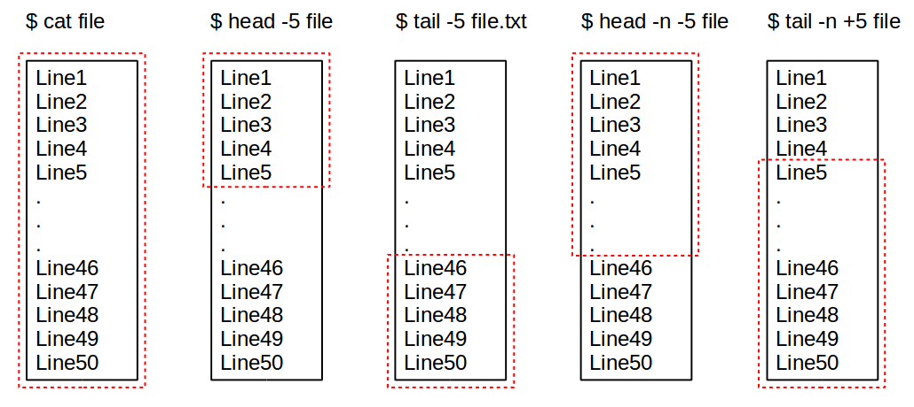
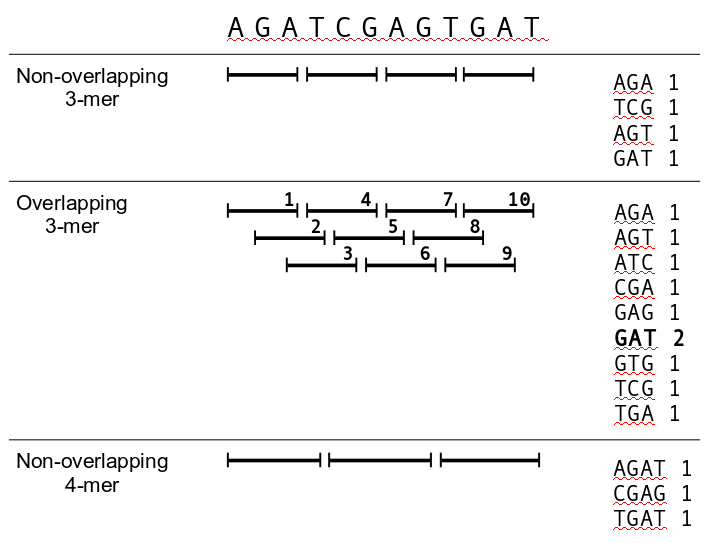

# GNU/Linux Komutları

Terminalde kullanılabilecek komutların tamamı oldukça uzun bir liste oluşturabilir. Kitapta verilen komutlar buradaki örneklerin ve problemlerin çözülmesi için gerekli olan komutlardır. Listenin tamamı aşağıdaki kaynaklarda bulunabilir:

* [ss64.com](http://ss64.com/bash/)
* Terminalde **`compgen -acbk`** komutu çalıştırılabilecek bütün komutları listeler.
* [Linux Complete Command Reference](http://www.amazon.com/Linux-Complete-Command-Reference-Purcell/dp/0672311046/ref=pd_sim_sbs_14_2?ie=UTF8&refRID=0JBHXM2MMTRM2TXDF3JX) adlı kitap
* [Linux in a Nutshell](http://www.amazon.com/Linux-Nutshell-Ellen-Siever/dp/0596154488) adlı kitap

Yukarıdaki kaynaklara ek olarak, [ExplainShell](http://explainshell.com/) adlı websayfasını kullanarak, kitaptaki komutların veya başka kaynaklarda karşılaştığınız komutların açıklamalarını görebilirsiniz. 

Ayrıca, bu kitapta verilen komutların fazla sayıda opsiyonları (veya argümanları) bulunmaktadır. Bu kitapta sadece Veri Analizi ve Görüntüleme dersi için yeterli olanları gösterilecektir. Bütün opsiyonları görmek için **`man komut`** ile komuta ait detaylı bilgilere ulaşılabilir.

> ### Başlamadan Önce
>
> Aşağıdaki komutlardaki örneklerin ve bölüm sonlarındaki soruların yapılabilmesi için kitapla beraber hazırlanmış arşiv dosyası aşağıdaki komutlar yardımıyla indirilip açılmalıdır.
>
>    curl -L  https://goo.gl/i4wD9H > veri-analizi-bundle.tar.gz
>    tar xzf veri-analizi-bundle.tar.gz


## man komutu

İngilizce orijinal tarifi: "an interface to the on-line reference manuals"

Komutların farklı fonksiyonlarını ve görevlerini görüntüler. Örneğin **`ls`** komutunun kullanımını öğrenmek için **`man ls`** yazıp enter tuşuna basıldığında aşağıdaki ekran görülür. Aşağı ve yukarı ok tuşları ile interaktif olarak doküman okunabilir ve açılan dosyadan q tuşu ile çıkış yapılır.

<<[Şekil 2.1 ls komutunun man komutu ile açıklanması](code/man-ls.txt)

## ls komutu

İngilizce orijinal tarifi: "list directory contents"

Geçerli dizindeki dosyaların alfabetik olarak sıralanmış listesini gösterir. Nokta (.) karakteri ile başlayan dosya isimlerini ilk sıraya koyar. Birçok opsiyonu olmakla birlikte, en çok kullanılan opsiyonlar şunlardır:

* **`ls -a`** (all) : Geçerli dizindeki tüm dosyaların listesini gösterir. Gizli dosya ve dizinleri de gösterir.
* **`ls -l`** (long) : Geçerli dizindeki tüm dosyaları ayrıntılarıyla gösterir. (izin - kullanıcı - boyut - tarih - dosya adı)
* **`ls -t`** (time) : Geçerli dizindeki dosyaları yüklenme tarihlerine göre sondan başa doğru sıralayarak gösterir.
* **`ls -S`** (size) : Geçerli dizindeki dosyaları boyutlarına göre büyükten küçüğe doğru sıralayarak gösterir.
* **`ls -r`** (reverse) : Sıralama düzenini tersine çevirerek gösterir. Eğer başka bir seçenekle kullanılmamışsa alfabetik sıralamanın tersine göre.
* **`ls -R`** (recursive) : Tüm dosyaları alt dizinleri ve içerikleri ile birlikte gösterir.
* **`ls -h`** (human readable) : Tüm dosyaları insan okunabilir şekilde gösterir. Ama tek başına işlevi yoktur. Dosya boyutunu gösteren seçenekler ile birlikte kullanılmalıdır.

Klasörünüzde, `veri-analizi-bundle.tar.gz` adlı arşivi açtıktan sonra `ls` komutunun çıktısı aşağıdakine benzer olacaktır. Eğer kullandığınız terminalde renkli `ls` çıktısı ayarı yapılmışsa, klasörler (mavi), resimler (pembe), arşiv dosyaları (kırmızı) gibi farklı öğeler farklı renkler ile gösterilecektir.



Seçenekler birleştirilerek de kullanılabilirler. Örnek; ls -lrt dosyaları tarihlerine göre baştan sona doğru ve ayrıntılarıyla gösterir.

<<[Şekil 2.2b ls komutunun farklı opsiyonları/argümanları](code/ls-ornek.txt)

## cd komutu

Klasör değiştirerek, dizinler arası gezinmeyi sağlayan komuttur. Göreceli veya mutlak olarak klasör belirtmek mümkündür. Göreceli klasör belirtmek o anda çalışılan klasöre göre konum belirleyerek, mutlak konum belirleme ise kökten (İng. root) (/) başlayarak gidilmek istenen yer belirterek gerçekleşmektedir.

* **`cd <klasör.adı>`** : \<klasör.adı\> isimli klasörün içine girmeyi sağlar.
* **`cd ~`** : Hangi klasörde olunursa olunsun kullanıcının home klasörüne gitmeyi sağlar.
* **`cd ..`** : İşlem yapılan klasörün bir üst klasörüne geri dönmeyi sağlar.
* **`cd ../..`** : İşlem yapılan klasörün iki üst klasörüne gitmeyi sağlar.
* **`cd -`** : İşlem yapılan klasörden bir önce girilen klasöre gitmeyi sağlar.

> Terminalde sadece `cd` yazarak Enter tuşuna basıldığında `cd ~` şeklinde çalışır ve kullanıcının home klasörüne geçiş yapılır.

<<[Şekil 2.3 cd komutunun farklı kullanımları](code/cd-ornek.txt)

%%%% TODO cd example is not clear

> [Boşluk karakteri](#bosluk-karakteri) içeren dosya ve klasör isimlerine dair dikkat edilmesi gereken durum hakkında ilgili bölümü okuyunuz.

>### Sorular
>* `find-file` adlı klasör içinde cd ve ls komutları yardımıyla `image.jpg` dosyasını bulunuz.

## mkdir komutu

İngilizce orijinal tarifi: "make directories"

Geçerli dizinde klasör açmayı sağlayan komuttur.

* **`mkdir <klasör.adı>`** : Geçerli dizin içine \<klasör.adı\> isimli klasörün açılmasını sağlar.
* **`mkdir -p <klasör.adı1>/<klasör.adı2>/<klasör.adı3>`** : Geçerli klasör içine \<klasör.adı1\> isimli klasör, alt klasörü olarak \<klasör.adı2\> isimli bir klasör ve onun da alt klasörü olarak \<klasör.adı3\> isimli klasör açar. Komutun çalışabilmesi için klasör sayılarında bir sınırlama yoktur.

<<[Şekil 2.4 mkdir komutunun kullanımı](code/mkdir-ornek.txt)

## pwd komutu

İngilizce orijinal tarifi: "print name of current/working directory"

İçinde bulunulan klasörün mutlak konumunu ekranda gösterir.

<<[Şekil 2.5 pwd komutunun kullanımı](code/pwd-ornek.txt)

## touch komutu

Geçerli dizinde boş bir dosya açmayı sağlayan komuttur.

* **`touch <dosya.adı>`** : Geçerli dizin içine \<dosya.adı\> isimli boş bir dosya oluşturur.

>### Sorular
>* `touch` komutu yardımıyla, `test.png`, `test.mp3`,`test.doc` adlı dosyalar oluşturulursa, bunlar sırasıyla resim, müzik ve Word dökümanı mı olurlar?
>* `mkdir` ve `touch` komutlarını kullanarak `genomes` adlı klasör oluşturup içinde aşağıda gösterilen klasör ve dosya yapısını oluşturunuz. 



> `tree` komutu kullanılarak resimdeki ağaç şeması elde edilebilir. **tree klasör.adı** şeklinde kullanıldığında istenen klasörün ağaç şeması şeklinde görünmesini sağlar.


> Doğru klasör yapısı oluşturulduğunda `genomes` klasörü içinde `find` komutunun çıktısı aşağıdaki gibi olmalıdır:

<<[genomes klasörü içeriği - find komutu çıktısı](code/genomes-folder.txt)

## rm komutu

İngilizce orijinal tarifi: "remove files or directories"

Geçerli dizinde bulunan dosyaları veya klasörleri silmeyi sağlar. 

* **`rm <dosya.adı>`** : Geçerli dizin içindeki \<dosya.adı\> isimli dosyanın silinmesini sağlar.
* **`rm -r <klasör.adı>`** : Klasörleri altdizin ve içerisinde bulunan dosyalar ile birlikte siler. Komut bazı durumlarda çalışmadan önce onay ister ve onaylamak için y tuşuna basılmalıdır.

<<[Şekil 2.6 rm komutunun kullanımı](code/rm-ornek.txt)

> Terminalde, "çöp kutusu" kavramı olmadığından dosyalar geri dönüşüme gitmeden silinir.

## cp komutu

İngilizce orijinal tarifi: "copy files and directories"

Geçerli klasör içinde bulunan bir dosyanın, başka bir klasöre veya başka bir dosyanın üzerine kopyalanmasını sağlar. 

* **`cp <kaynak.dosya.adı> <hedef.dosya.adı>`** : Geçerli klasördeki \<kaynak.dosya.adı\> isimli dosyanın \<hedef.dosya.adı\> isimli dosya olarak kaydedilmesini sağlar.
* **`cp -i <kaynak.dosya.adı> <hedef.dosya.adı>`** : Var olan bir dosya üzerine yazma durumlarında interaktif şekilde onay istenmesini sağlar. 
* **`cp -p`** : Kopyalanacak olan dosyanın kopyalama sırasında [dosya ve klasör izinleri](#dosya-klasor-izin) kısmında anlatılan izin ve özelliklerini değiştirmeden kopyalanmasını sağlar.
* **`cp -r`** : Klasörleri alt dizinleri ve dosyaları ile birlikte kopyalar.
* **`cp -u`** : Güncelleme olduğunda dosya ve klasörleri değiştirmeden kopyalar.

Kopyalanan dosya aynı klasör içine değil, farklı bir klasör içine kopyalanmak isteniyorsa; hedef klasörün ismi ~/\<hedef.klasör.adı\> şeklinde yazılmalıdır. Komutu kullanmak için kopyalanacak dosyanın bulunduğu klasör içinde olmaya gerek yoktur. Herhangi bir klasörden her klasöre kopyalama yapılabilir.

<<[Şekil 2.7 cp komutunun kullanımı](code/cp-ornek.txt)

%%%% TODO: cp komutu örneği geliştirilmeli, PATH (relative and absolute) kavramı bahsedilmeli

##  mv komutu

İngilizce orijinal tarifi: "move (rename) files"

Dosyaların aynı isimle ya da ismi değiştirilerek farklı bir klasör içine taşınmasını sağlar.

* **`mv <dosya.adı> <hedef.klasör.adı>`** : Geçerli dizin içindeki dosya hedef klasöre kopyalanıp geçerli dizindeki kopyası silinir, böylelikle dosya hedef klasöre taşınmış olur. Bu işlem aynı klasör içinde gerçekleştirilirse dosya ismi değiştirilmiş olur. 

<<[Şekil 2.8 mv komutunun kullanımı](code/mv-ornek.txt)

%%%% TODO mv example was not clear.. mv-ornek.txt has been updated by gamzebagımsız, can be improved further..

> [Boşluk karakteri](#bosluk-karakteri) içeren dosya ve klasör isimlerine dair dikkat edilmesi gereken durum hakkında ilgili bölümü okuyunuz.

>### Sorular
>* Sayı1000 isimli dosyanın sayılar adlı **kopyasını** oluşturun.
>* `sayılar` dosyasını `depo` isimli yeni bir klasör açarak içine taşıyın.
>* `depo` klasörünü `depo2` klasörü olarak içindeki sayılar dosyası ile birlikte taşıyın.
>* `touch` komutu egzersizinde oluşturmuş olduğunuz `genomes` adlı klasörün içeriklerini, mkdir, touch, cp, mv komutlarını kullanarak aşağıdaki hale getiriniz.



> Yukarıdaki soruda, `fish` klasörü altında bulunan `penguen.fa` dosyasının `birds` adlı klasörün altına taşınması için `fish` klasörü içinde olmak şart değildir. Herhangi bir klasörde iken uygun `mv` komutu ile taşıma gerçekleştirilebilir. Taşınacak dosyanın bulunduğu klasör veya hedef klasör mutlak veya göreceli olarak belirtilebilir. Aşağıdaki örnekte üç farklı geçerli dizinde bulunurken `mv` komutunun nasıl yazılacağı gösterilmiştir.

<<[Şekil 2.8a mv komutunun geçerli dizine göre değişmesi](code/mv-path.txt)

> universiteler.tar.gz adlı arşiv dosyasının içeriği ÖSYM'nin [2015 tarihli kılavuzuna](http://dokuman.osym.gov.tr/pdfdokuman/2015/OSYS/OSYS2015YerlestirmeMinMaxTablo-423072015.pdf) göre hazırlanmıştır. Her bir üniversite ve içerdiği fakülteler klasör olarak, bölümler de dosya olarak gösterilmiştir. Arşiv dosyasını açtıktan sonra aşağıdaki soruları cevaplayınız:
>
>* YTU altında "Tip Fakultesi" açınız.
>* YTU Tip Fakultesi altına Dahiliye ve Cildiye bölümleri açınız.
>* YTU'den "Iktisadi ve Idari Bilimler Fakultesi"ni kaldırınız.
>* YTU'ye Isik Univ. "Guzel Sanatlar Fakultesi"ni bölümleriyle beraber kopyalayınız.
>* IPEK UNIVERSITESI, Insan ve  Toplum Bilimleri Fakultesi altındaki bütün ingilizce bölümleri kapatınız.

%%%% TODO we need more questions for cp, mv, mkdir

> Uzun klasör isimlerini yazarken ilk birkaç harften sonra Tab tuşuna basıldığında klasör veya dosya adı tamamlanacaktır.

## seq komutu

İngilizce orijinal tarifi: "print a sequence of numbers"

Belli artımlarla sayı oluşturulup ekranda görüntülenmesini sağlar. Üç farklı kullanım seçeneği vardır. Bunlar:

* **`seq <sayı>`** : 1'den başlayarak, belirtilen sayıya kadar olan ardışık sayıları ekrana basar.
* **`seq <sayı1> <sayı2>`** : Sayı1'den başlayarak sayı2'ye kadar olan ardışık sayıları ekrana basar.
* **`seq <sayı1> <artım.miktarı> <sayı2>`** : sayı1'den başlayarak sayı2'ye kadar, belirtilen artım miktarı kadar artan sayıları ekrana basar.
* **`seq -w`** : Sayıların eşit genişlikte olmasını sağlar. Böylelikle, üretilen sayılar alfabetik sıralama için uygun hale gelir ve sayısal sıralamaya gerek kalmaz.

<<[Şekil 2.9 seq komutunun kullanımı](code/seq-ornek.txt)

## shuf komutu

İngilizce orijinal tarifi: "generate random permutations"

Rastgele sıralama yapılmasını sağlar.

* **`shuf <dosya.adı>`** : Geçerli dizindeki \<dosya.adı\> isimli dosya içinde bulunan bilgilerin sıralamasını, rastgele permutasyonlar şeklinde gerçekleştirir.

> Aşağıdaki örnekte de görüldüğü gibi, **`shuf`** komutu ve birçok komut, hem bir dosya üzerinde çalıştırılabilir hem de çubuk ile başka bir komutun çıktısı üzerinde çalıştırılabilir.

<<[Şekil 2.10 shuf komutunun kullanımı](code/shuf-ornek.txt)

>### Sorular
>* 1-100 arası 5'e bölünebilen sayıları ekranda görüntüleyin.
>* 1-50 arası 3'e bölünebilen rakamları ekranda görüntüleyin.

## cat komutu

İngilizce orijinal tarifi: "concatenate files and print on the standard output"

Dosyaların görüntülenmesini sağlar. Komutun `tac` şeklinde, tersten çalıştırılarak dosyanın sondan başa doğru görüntülenmesi de mümkündür.

* **`cat <dosya.adı>`** : Geçerli dizinde bulunan dosyaların içinin ekranda görüntülenmesini sağlar.

<<[Şekil 2.11 cat ve tac komutlarının kullanımı](code/cat-ornek.txt)

## head komutu

İngilizce orijinal tarifi: "output the first part of files"

Dosya içeriğinin başından ne kadar uzunlukta görüntüleneceğini belirler.

* **`head <dosya.adı>`** : Geçerli dizinde bulunan dosya.adı isimli dosyanın ilk 10 satırının görüntülenmesini sağlar.
* **`head -numara <dosya.adı>`** : Geçerli dizinde bulunan dosya.adı isimli dosyanın baştan itibaren, belirtilen sayıda satırının görüntülenmesini sağlar.
* **`head -n -<sayı> <dosya.adı>`** : Geçerli dizinde bulunan dosya.adı isimli dosyanın son `sayı` kadar satırı hariç bütün satırların görüntülenmesini sağlar.

## tail komutu

İngilizce orijinal tarifi: "output the last part of files"

Dosya içeriğinin sonundan kaç satır görüntüleneceğini belirler. Satırları tersten değil olması gereken sırada görüntüler.

* **`tail <dosya.adı>`** : Geçerli dizinde bulunan dosya.adı isimli dosyanın son 10 satırının görüntülenmesini sağlar.
* **`tail -numara <dosya.adı>`** : Geçerli dizinde bulunan dosya.adı isimli dosyanın sondan itibaren, belirtilen sayıda satırının görüntülenmesini sağlar.
* **`tail -n +<sayı> <dosya.adı>`** : Geçerli dizinde bulunan dosya.adı isimli dosyanın `sayı`. satırından itibaren görüntülenmesini sağlar.

<<[Şekil 2.12 head ve tail komutlarının kullanımı](code/head-tail-ornek.txt)



>### Sorular
>* 20'den başlayarak sıralı 55. sayıyı ekranda görüntüleyin.
>* İlk 175 sayının son 10 tanesini ekranda görüntüleyin.
>* 7'ye bölünebilen ilk 15 sayının rastgele seçilmiş 5 tanesini ekranda görüntüleyin.
>* sayı1000 dosyasından 850-860 arasındaki sayıları ekranda görüntüleyin. (850 ve 860 dahil.)
>* sayı1000 dosyasının en ortasında bulunan iki sayıyı ekranda görüntüleyin.
>* sayı1000 dosyasındaki ilk çift sayıdan sonraki 24. sayıyı ekranda görüntüleyin.
>* harfler dosyasındaki 15. satırdaki harfi bulunuz.

## less komutu

Geçerli dizinde bulunan dosyaların interaktif şekilde görüntülenmesini sağlar. Ok tuşları ile ekran kaydırılabilir, > tuşu ile dosya sonuna, < tuşuyla dosyanın başına gidilebilir. Ayrıca, dosya içinde arama yapmak da mümkündür. Açılan ekrandan q tuşuna basılarak çıkış yapılır.

* **`less <dosya.adı>`** : Geçerli klasördeki \<dosya.adı\> isimli dosya içinde yazılı olanları farklı bir bölümde görüntüler. 
* **`less -N <dosya.adı>`** : Dosya içeriğini satırlara numara vererek görüntüler. 
* **`less -R <dosya.adı>`** : Dosya içinde bulunan özel karakterlerin görüntülenmesini sağlar. Terminalde var olan renklerin korunması için kullanılabilir.

## echo komutu

İstenilen yazıların ekrana basılmasını sağlar.

* **`echo "yazı"`** : Yazı ifadesinin ekrana basılmasını sağlar. 

<<[Şekil 2.14 echo komutunun kullanımı](code/echo-ornek.txt)

## rev komutu

İngilizce orijinal tarifi: "reverse lines of a file or files"

Dosya veya girdi içeriğindeki karakterleri ters sırada ekrana yazar.

* **`rev <dosya.adı>`** : Geçerli klasörde bulunan \<dosya.adı\> isimli dosyanın içindeki satırların karakterlerini kendi içinde ters sırada ekranda görüntüler.

<<[Şekil 2.15 rev komutunun kullanımı](code/rev-ornek.txt)

## Dosya türleri ve uzantıları (uyguluma)

Birinci bölümde açıklanan [dosya türleri](#dosya-turleri) konusunu uygulamalı olarak anlamaya çalışalım. `seq 1 10` komutu yardımıyla .png, .doc, .xls, .csv, ve .txt dosyaları oluşturunuz.

<<[Şekil 2.15n Farklı türlerde dosya oluşturulması](code/dosya-turleri.txt)

Klasörünüzde önceden bulunan `real.doc` dosyası ile yeni oluşturduğunuz `fake.doc` adlı dosyayı hem Linux terminalinde hem de Windows işletim sisteminde karşılaştırınız (bunu xls, png, csv dosyaları için de tekrar ediniz)

Klasörünüzde bulunan `real.svg` dosyası [scalable vector graphics](https://en.wikipedia.org/wiki/Scalable_Vector_Graphics) adlı bir resim formatı olup, düzyazı (plain text) karakterleri kullanılarak resim çizdirme komutlarının özel bir [XML formatı](https://en.wikipedia.org/wiki/XML) haline getirilmesiyle ortaya çıkar. Kısacası, doc, xls veya png gibi dosya türleri binary format olabildiği gibi, plain text formatında olan dosyalar ile de resim veya diğer tür formatlar türetilebilir.

> Dosyaları Windows'ta açabilmek için winscp adlı program yardımıyla dosyaları uzaktaki makineden (remote) çalıştığınız makineye (local) taşımanız gerekmektedir. Winscp programının kurulumu için Ek-1'deki winscp hakkındaki bölüme bakınız.

> Binary format dosyaların ekrana yazdırılması sırasında çıkan karakterler terminalin işleyişini bozabilir. Bu tür durumlarda `reset` yazarak `enter` tuşuna basınız.

## tr komutu

İngilizce orijinal tarifi: "translate or delete characters"

Dosya içindeki veya girdideki karakterlerin başka karakterlere dönüştürülmesini sağlar. Diğer komutlar gibi **`tr <dosya.adı>`** şeklinde çalışmaz. Genellikle `cat` komutu ile birlikte işlev gösterir.

* **`cat <dosya.adı> | tr <değiştirilecek.karakterler> <hedef.karakterler>`** : Geçerli klasörde bulunan \<dosya.adı\> isimli dosyanın içinde bulunan değiştirilecek karakterlerin hedef karakterlere dönüştürülmesini sağlar.
* **`cat <dosya.adı> | tr -d "karakterler"`** : Geçerli klasörde bulunan \<dosya.adı\> isimli dosyanın içinde bulunan belirtilen karakterlerin silinmesini sağlar.

Boşluk, enter ve tab gibi özel karakterlerin de değiştirilmesi mümkündür. Boşluk için `""`, enter için `\n` ve tab için `\t` şeklinde ifadeler kullanılmalıdır.

<<[Şekil 2.16 tr komutunun kullanımı](code/tr-ornek.txt)

> "ABCDEFGHJKLMNOPRSTUVYZ" şeklindeki karakter listesi [A-Z] şeklinde yazılabilir. Ayrıca, tr komutunda [:alpha:] , [:alnum:] gibi belirli karakter dizilerinin kısa gösterimleri kullanılabilir. Listenin tamamı için tr komutunun kullanma talimatını okuyunuz.


`tr` komutu ile karakter silme veya değiştirme yapılırken tekrarları ortadan kaldırmak (squeeze) ve tamamlayan küme (complement) özellikleri tek başına veya beraber kullanılabilir. Aşağıdaki örneklerde farklı `tr` özelliklerinin karıştırılarak nasıl beraber kullanılabileceği gösterilmiştir.

<<[Şekil 2.16b tr komutunun delete, squeeze, complement özellikleri](code/tr-ultimate.txt)

>### Sorular
>* 'fark' kelimesinden 'pile' kelimesine kadar dört kademede olarak her kademede bir harf değiştirerek anlamlı kelimeler oluşturun. Örnek olarak kal kelimesinden sek kelimesine inmek şu şekilde gerçekleşir: kal - sal - sel - sek.
>* 'Yarın' kelimesini değiştirerek 'kadın' kelimesi olarak ekranda görüntüleyin.
>* AGTCAGCTACGACTACGACTACGACTAGCATCAA dizisinin ters eşleniğini (reverse complement) hesaplayınız.

%%%% TODO we should have plenty of tr questions for practicing

## Dökümanların kelimelere ayrılması

Dökümanlara yönelik analizlerde (örn. [Sentiment Analysis](https://en.wikipedia.org/wiki/Sentiment_analysis), [döküman sınıflandırma](https://en.wikipedia.org/wiki/Document_classification), [spam filtresi](https://en.wikipedia.org/wiki/Email_filtering), [otomatik özetleme](https://en.wikipedia.org/wiki/Automatic_summarization)), [NLP](https://en.wikipedia.org/wiki/Natural_language_processing) çalışmalarında cümleleri simgelere ayırmak (ing. [tokenization](https://en.wikipedia.org/wiki/Tokenization_(lexical_analysis))) ilk adımdır. Terminalde bu adım `tr` komutu ile yapılabilmektedir. Bir dökümandaki yabancı öğeler (noktalama işaretleri) ayıklanarak kelimeler sayılabilir, analiz edilebilir hale getirilir.

`tr -d` opsiyonu ile noktalama işaretleri ve sembolleri silmek aşağıdaki gibi mümkündür:

```
tr -d ".,:;!?/+-&%()"
```

Fakat böyle bir komutta, terminalde özel anlamı olan karakterler `tr` komutunun yanlış çalışmasına sebep olabilir. Bu yüzden `tr` komutu için tanımlanmış özel kümeleri kullanmak daha güvenli ve pratik olacaktır. Noktalama işaretleri için kullanılan küme `[[:punct:]]` şeklinde ifade edilebilir. Noktalama işaretlerinin silinmesi, dökümanda daha önce olmayan kelimeler ortaya çıkarıp yanlış hesap yapmaya sebep olabilir, bu yüzden noktalama işaretlerini silmek yerine boşluk karakteri ile yerdeğiştirmek daha doğru olacaktır. 

> Maalesef `I'm, I've, I'd, Emma's` gibi durumlarda noktalama işaretinin silinmesi ekstra harfler oluşturacaktır.

Birden fazla boşluk karakteri yanyana iken tek boşluk haline getirmek için `tr -s` (squeeze) opsiyonu kullanılabilir. 

```
tr [[:punct:]] " " | tr -s " "
```

Kelimelerin sayılabilmesi için tek sütun haline getirmek, ayrıca büyük küçük harf farkından dolayı yanlış sayım yapmamak için, boşluk karakterini satır sonu karakteri ile yer değiştirip, büyük harfleri de küçük harfe çevirmeliyiz.

```
tr [[:punct:]] " " | tr -s " " | tr " " "\n" | tr A-Z a-z
```

Bütün bu işlemler çok daha pratik bir şekilde aşağıdaki komutla gerçekleştirilebilir.

```
tr -sc [A-Za-z] "\n" | tr A-Z a-z
```

Yukarıdaki komutları daha iyi anlayabilmek için adım adım örnek dosya üzerinde komutları inceleyelim. Örnek dosya adı `cumle-noktalama` olup içeriği aşağıdaki gibidir:

```
$ cat cumle-noktalama 
'Goodness gracious!  Is that you, Mr. Bumble, sir?' said Mrs. Mann, 
thrusting her head out of the window in well-affected ecstasies of 
joy. '(Susan, take Oliver and them two brats upstairs, and wash 'em
directly.)--My heart alive!  Mr. Bumble, how glad I am to see you, 
sure-ly!'
```

Bazı noktalama işaretlerinin terminalde özel manası olduğundan yanlış yorumlanabilir.

```
$ cat cumle-noktalama | tr -d ".,:;!?/+-&%()"
bash: !?/+-&%()": event not found

$ cat cumle-noktalama | tr -d '.,:;!?/+-&%()'
tr: range-endpoints of '+-&' are in reverse collating sequence order
```

`[[:punct:]]` kısayolu ile bütün noktalama işaretlerini silebilir veya değiştirebiliriz.

```
$ cat cumle-noktalama | tr -d [[:punct:]]
Goodness gracious  Is that you Mr Bumble sir said Mrs Mann 
thrusting her head out of the window in wellaffected ecstasies of 
joy Susan take Oliver and them two brats upstairs and wash em
directlyMy heart alive  Mr Bumble how glad I am to see you 
surely
```

Noktalama işaretlerini silmek bazı kelimeleri ve harfleri kaynaştırıp daha önce olmayan kelimeler ortaya çıkarabildiğinden boşluk karakteri ile yerdeğiştirmek daha güvenli olacaktır.

```
$ cat cumle-noktalama | tr [[:punct:]] " " 
 Goodness gracious   Is that you  Mr  Bumble  sir   said Mrs  Mann  
thrusting her head out of the window in well affected ecstasies of 
joy    Susan  take Oliver and them two brats upstairs  and wash  em
directly    My heart alive   Mr  Bumble  how glad I am to see you  
sure ly
```

Yanyana bulunan birçok boşluk karakteri tek bir boşluk karakterine dönüştürülebilir.

```
$ cat cumle-noktalama | tr [[:punct:]] " " | tr -s " "
 Goodness gracious Is that you Mr Bumble sir said Mrs Mann 
thrusting her head out of the window in well affected ecstasies of 
joy Susan take Oliver and them two brats upstairs and wash em
directly My heart alive Mr Bumble how glad I am to see you 
sure ly
```

Kelimelerin daha kolay sayılabilmesi için tek sütun haline getirmeliyiz, bunun da en pratik yolu boşluk karakterini `\n` yani satır sonu (Enter) karakteri ile yerdeğiştirmektir. (Çıktının sadece 5 satırı gösterilmiştir)

```
$ cat cumle-noktalama | tr [[:punct:]] " " | tr -s " " | tr " " "\n" | head -5

Goodness
gracious
Is
that
```

Kelime sayımının doğru olabilmesi için küçük harf ve büyük harf farkının ortadan kaldırılması gerekmektedir. Örneğin "You" ve "you" kelimelerinin ayrı ayrı sayılmaması gerekir.

```
$ cat cumle-noktalama | tr [[:punct:]] " " | tr -s " " | tr " " "\n" | tr A-Z a-z | head -5

goodness
gracious
is
that
```

`tr` komutunun farklı özelliklerini aynı anda kullanarak daha kısa komut yazabiliriz. `tr -c` opsiyonu tamamlayan küme manasında kullanılmaktadır. `tr -c A-Za-z` şeklindeki ifade büyük ve küçük harflerin dışında kalan bütün karakterler manasına denk gelir. Aşağıdaki komut çok pratik şekilde kelime ayırma ve saymaya hazır hale getirmek için kullanılabilir. 

```
$ cat cumle-noktalama | tr -sc [A-Za-z] "\n" | tr A-Z a-z | head -5

goodness
gracious
is
that
```

İlerleyen sayfalarda `sort` ve ` uniq` komutlarını öğrendikten sonra bir dökümanda kelimelerin kaç defa gözüktüğünü hesaplayacağız. 

## Kriptoloji ve Kriptoanaliz {#kriptoloji-intro}

Kriptoloji sayesinde herhangi bir mesaj belirli bir algoritma ile farklı bir hale dönüştürülüp güvenli olmayan kanaldan iletilebilir hale getirilmektedir. Bu tür dönüştürülmüş mesajlar üçüncü kişiler tarafından ele geçirilse çözümlenmesi gerekir (kriptoanaliz) ve kullanılan algoritmaya göre bu işlem basit veya çok zor olabilmektedir. 

Aşağıda verilen şifreli mesaj üzerinden basit bir kriptoanalizin nasıl yapıldığını anlamaya çalışalım.

```
d rnxht vhrvck vkkxow fyvf v ovfy genbwkkne'k pwec bvpnedfw twkkwef dk gd.
```

Eğer yukarıdaki şifreli mesaj [monoalfabetik yerdeğiştirme](https://en.wikipedia.org/wiki/Substitution_cipher) ile üretildi ise, yani her harf her seferinde sabit başka bir harfle yer değiştiriyorsa, şifrenin çözülmesi nispeten daha kolay olacaktır.
Şifreli mesaj İngilizce dilinde olduğundan İngilizce kelimelere ait özellikler kullanılarak şifre çözülmeye çalışılmalıdır. Aşağıdaki tabloda harf ve kelime görülme sıklıkları listelenmiştir ([kaynak](http://practicalcryptography.com/ciphers/simple-substitution-cipher/)). Ayrıca, [Google Books](https://books.google.com/googlebooks/about/) projesinden ortaya çıkan Google N-Gram verisini ([interaktif görüntülenebilir](https://books.google.com/ngrams) ve [indirilebilir](http://storage.googleapis.com/books/ngrams/books/datasetsv2.html) halleri mevcuttur) kelime ve harfler açısından değerlendiren [sayfayı](http://norvig.com/mayzner.html) da ziyaret edebilirsiniz.

{title="Tablo 2.1a İngilizce diline ait kelime ve harf özellikleri"}
| Özellik                                  | Liste                                    |
| :--------------------------------------- | :--------------------------------------- |
| Tek harfli kelimeler                     | I,a                                      |
| Sık kullanılan iki harfli kelimeler      | of, to, in, it, is, be, as, at, so, we, he, by, or, on, do, if, me, my, up, an, go, no, us, am |
| Sık kullanılan üç harfli kelimeler       | the, and, for, are, but, not, you, all, any, can, had, her, was, one, our, out, day, get, has, him, his, how, man, new, now, old, see, two, way, who, boy, did, its, let, put, say, she, too, use |
| Sırasıyla en sık kullanılan harfler      | E T A O I N S H R D L U                  |
| Sırasıyla en sık kullanılan iki harfler (digraph) | th er on an re he in ed nd ha at en es of or nt ea ti to it st io le is ou ar as de rt ve |
| Sırasıyla en çok karşılaşılan çift harfler | ss ee tt ff ll mm oo                     |
| Sırasıyla kelime başında en sık kullanılan harfler | T O A W B C D S F M R H I Y E G L N P U J K |
| Sırasıyla kelime sonunda en sık kullanılan harfler | E S T D N R Y F L O G H A K M P U W      |

Şifreli mesajda tek harfli kelime olarak "d" ve "v" bulunmaktadır. O halde bu iki harf ya "a" ya da "i" harflerine denk düşmektedir. Tablodaki karakteristik özelliklere göre harflerin karşılıkları bulunduğunda aşağıdaki eşleşme tablosu ortaya çıkar:

```
Input   bcdefghknoprtvwxy
Output  fyirtplsomvwdaeuh
```

Şifreli mesajda kelimelerin formları aynen korunduğundan dolayı, tek harfli kelimler veya üç harfli sık kullanılan kelimeleri saptamak kolay olmaktadır. Bu yüzden, şifrenin çözülmesini zorlaştırmak için, kelimelerin sınırları belirli olmayacak hale getirilmelidir:

```
drnxh tvhrv ckvkk xowfy vfvov fygen bwkkn ekpwe cbvpn edfwt wkkwe fdkgd
```

> Alfebedeki harfler 26! sayısında permütasyonlar ile a-z arası harflerle eşleştirilebilir. 

Oldukça eski ve ilkel bir yöntem olan [Sezar şifresi](https://en.wikipedia.org/wiki/Caesar_cipher), her bir karakterin alfabetik olarak belirli ve sabit sayıda kaydırılması ile yapılmaktadır. Eğer, üç harf kaydırma kullanılacak olursa "Zebra" kelimesi "Cheud" şekline dönüşmektedir. [ROT13 adlı şifreleme](https://en.wikipedia.org/wiki/ROT13), Sezar şefrelemesinin özel bir hali olup her karakter alfabetik olarak 13 karakter ilerletilmektedir. ROT kısaltması rotation kelimesinden gelmektedir yani alfabede bulunun harflerin, onlara belirli uzaklıktaki harflerle yer değiştirmesidir.ROT13 kullanıldığında "Zebra" kelimesi "Mroen" şeklinde yazılmaktadır. "Zebra" kelimesini ROT13 ile "Mroen" şifresine dönüştürmek için komut kısmına  `echo Zebra | tr a-zA-Z  n-za-mN-ZA-M` yazılmalı, "Mroen" şifresini de ROT13 ile çözmek için komut satırına `echo Mroen | tr n-za-mN-ZA-M` yazılmalıdır.

```
ROT1             Şifreleme                    Deşifreleme
Input    ABCDEFGHIJKLMNOPQRSTUVWXYZ   ABCDEFGHIJKLMNOPQRSTUVWXYZ
Output   BCDEFGHIJKLMNOPQRSTUVWXYZA   ZABCDEFGHIJKLMNOPQRSTUVWXY

ROT13
Input    ABCDEFGHIJKLMNOPQRSTUVWXYZ   ABCDEFGHIJKLMNOPQRSTUVWXYZ
Output   NOPQRSTUVWXYZABCDEFGHIJKLM   NOPQRSTUVWXYZABCDEFGHIJKLM

ROT25
Input    ABCDEFGHIJKLMNOPQRSTUVWXYZ   ABCDEFGHIJKLMNOPQRSTUVWXYZ
Output   ZABCDEFGHIJKLMNOPQRSTUVWXY   BCDEFGHIJKLMNOPQRSTUVWXYZA
```

ROT13, diğer anahtarlara göre özel bir yere sahiptir çünkü ROT13 için hem şifreleme hem de sifre çözme işlemi aynı anahtarla yapılmaktadır. Bu yüzden diğer anahtarlara göre çok daha yaygın olarak kullanılmaktadır.

Sezar şifresi çok kolaylıkla çözülebilir çünkü 25 farklı anahtar deneyerek sonuca ulaşılabilir (ROT1 -- > ROT25). Terminalde bunun güzel bir örneği [bu sayfada](https://sandilands.info/sgordon/classical-ciphers-frequency-analysis-examples) gösterilmiştir. [Decrypting Text](http://www.richkni.co.uk/php/crypta/caesar.php) adlı websayfasında, kutuya yazılan yazı 25 farklı kaydırma ile denenip deşifre edilmektedir. Harfleri rastgele karıştırmak mümkün olsa da, sırası unutulmayacak bir karıştırma daha çok tercih edilmektedir. Bunun için kullanılan yöntemlerden biri, anahtar kelime  kullanmaktır. Aşağıdaki eşleşme tablosu `LINUX` kelimesi kullanılarak oluşturulmuştur. Anahtar kelime ilk önce yazılmış ardından da anahtar kelimede olmayan harfler sırasıyla yazılmıştır. "Y" ve "Z" harflerinin yerleri değiştirilmiştir çünkü **eşleşme tablosunda hiçbir harf kendiyle eşleşmemelidir**.

```
Input   ABCDEFGHIJKLMNOPQRSTUVWXYZ
Output  LINUXABCDEFGHJKMOPQRSTVWZY
```

Böyle bir durumda şifrelenmiş yazıda harflerin frekansını inceleyip eşleşme tablosu tahmin edilmeye çalışılabilir. `sort` ve `uniq` komutlarını öğrendikten sonra bu tür analizin nasıl yapıldığına dair örnekler göreceksiniz.

Polialfabetik şifreleme, monoalfabetik yöntemlere göre çözümlemesi çok zor bir tekniktir. Bir harf, birden fazla karaktere eşlendiğinden dolayı yukarıda anlatılan tekniklerin hiçbirisi işe yaramayacaktır. En ünlü polialfabetik şifreleme 2. Dünya Savaşı sırasında kullanılan [Enigma](https://en.wikipedia.org/wiki/Enigma_machine) makinesidir. Bu makinenin nasıl çalıştığına dair [videoyu](https://www.youtube.com/watch?v=G2_Q9FoD-oQ) ve deşifre edilmesinde kullanılan kusuru anlatan [video](https://www.youtube.com/watch?v=V4V2bpZlqx8)ları izleyebilirsiniz.

>### Sorular
>* `HELLO` kelimesini ROT1 ile şifreleyin.
>* ROT1 ile şifrelenmiş `MJOVY SPDLT` mesajını çözümleyiniz.
>* `HELLO` kelimesini ROT13 ile şifreleyin.
>* ROT13 ile şifrelenmiş `YVAHK EBPXF` mesajını çözümleyiniz.
>* `Hello World` ifadesini ROT13 ile şifreleyiniz.
>* `gizli_mesaj` adlı dosyadaki şifreyi, yukarıdaki örnekte verilen eşleşme tablosuna göre çözümleyiniz.
>* `data analysis and visualization` ifadesini `ZEBRA` kelimesini anahtar kullanarak şifreleyiniz.
>* [Obfuscation](https://en.wikipedia.org/wiki/Obfuscation) örneği olan komutun çıktısını irdeleyiniz: `echo wftedskaebjgdBstbdbsmnjgz  | tr "a-z" 'oh, turtleneck Phrase Jar!'`

> ### MD5 digest ve SHAsum
> Bir websayfasından indireceğimiz veya emaille gelen bir dosyanın gerçekten de yazarı tarafından oluşturulmuş dosya olup olmadığından emin olmak için kullanılan yöntemler vardır. Bunlardan en basiti ve en yaygın olanı dosya ile beraber MD5 digest veya SHAsum değerlerini de yayınlamaktır. Elde ettiğimiz dosyada her hangi bir gizli değiştirme olup olmadığını dosya üzerinde MD5 veya SHA hesabı yaparak anlayabiliriz. Dosyada tek bir bit veya karakter değiştiğinde MD5 ve SHA değerleri tamamen değişmektedir.
>
> 3,147,289,058 karakterden oluşan insan genomu dosyası (hg19.fa) ile tek bir mutan taşıyan dosya (hg19_mutant.fa) arasında sadece karakterlik fark vardır, 168. satırda üçüncü A, G ile yer değiştirmiştir.
>
> ~~~~~~~~~~~~~~~
>    $ diff hg19.fa hg19_mutant.fa 
>    168c168
>    < NNNNNNNNNNNNNNNNNNNNNNNNNNNNNNNNNNNNNNNNTAACCCTAACCCTAACCCTA
>    ---
>    > NNNNNNNNNNNNNNNNNNNNNNNNNNNNNNNNNNNNNNNNTAACCCTGACCCTAACCCTA
> ~~~~~~~~~~~~~~~
>
> İki dosya için SHAsum hesaplandığında çok farklı değerler bulunmaktadır:
>
> ~~~~~~~~~~~~~~~ 
>    $ sha256sum hg19.fa
>    492c8d6337990dd017b065abb4559509e0853521976868c57dc6634d1d1796d7  hg19.fa
>    
>    $ sha256sum hg19_mutant.fa
>    b8145a245624395c7d41671d8ed3d4a1afd3032ac9a5ff37e23ced3c3898fa60  hg19_mutant.fa
> ~~~~~~~~~~~~~~~
>


## sort komutu

İngilizce orijinal tarifi: "sort lines of text files"

Geçerli dizinde bulunan bir dosyanın içeriğinin alfabetik olarak sıralanmasını sağlar.

* **`sort <dosya.adı>`** : Klasörde bulunan \<dosya.adı\> isimli dosyanın sıralanması sağlar.
* **`sort -r <dosya.adı>`** : Sıralamanın tersine çevrilmesi sağlar.
* **`sort -n <dosya.adı>`** : Sıralamanın sayısal değerlere göre yapılması sağlar.
* **`sort -k<kolon.numarası> <dosya.adı>`** : Sıralamanın belirlenen kolona göre yapılması sağlar.
* **`sort -u <dosya.adı>`** : Sıralamayı yaparken birden fazla olan modellerin bir kere gösterilmesini sağlar.
* **`sort -t 'ayrac.turu' <dosya.adı>`** : Sıralama yaparken \<dosya.adı\> isimli dosyanın kolonlarını 'ayrac.turu' ne göre belirler.

<<[Şekil 2.17 sort komutunun kullanımı](code/sort-ornek1.txt)

<<[Şekil 2.18 sort komutunun kullanımı (devamı)](code/sort-ornek2.txt)

> Kitaptaki örneklerde çıktının daha düzgün görünmesi için `column -t` komutu eklenmektedir. Çıktının düzeni önemli değilse `column -t` komutunun kullanılmasına gerek yoktur. 

Her ne kadar `sort` komutunun sayısal sıralama özelliği olsa da, sayıları alfabetik olarak sıralamak da mümkündür. Sayılara sıfır ile soldan dolgu yapılırsa, alfabetik olarak sıralanabilir hale gelirler.

<<[Şekil 2.19 seq ve sort komutlarının birlikte farklı kullanımları](code/seq-sort-ornek.txt)

`sort` komutu aksi belirtilmedikçe bütün satırı değerlendirerek sıralama yapar, satırdaki karakterler sırasıyla karşılaştırılırlar. Bu durum, "ilk sütuna göre sıralama yapıldı" şeklinde yorumlanabilir. Aşağıdaki örnek, bütün satıra göre sıralamak ile ilk sütuna göre sıralamak arasında fark olduğunu göstermektedir. Ayrıca kolonların nasıl belirleneceği kullanıcıya aittir, kullanıcı herhangi bir kolon ayıracı belirtmemişse boşluk veya tab karakteri ayıraç olarak kullanılır. Aşağıdaki örnekte kolon ayıracı olarak `f` karakteri kullanıldığında sonuçların nasıl değiştiğini gözlemleyiniz.

```
$ echo -e "ab defgh\nabc efjk\na zcefhi"
ab defgh
abc efjk
a zcefhi

$ echo -e "ab defgh\nabc efjk\na zcefhi" > sort-test

$ sort sort-test                  | $ sort -t'f' sort-test
abc efjk                          | abc efjk
ab defgh                          | ab defgh
a zcefhi                          | a zcefhi
                                  |
$ sort -k1,1 sort-test            | $ sort -t'f' -k1,1 sort-test
a zcefhi                          | abc efjk
ab defgh                          | ab defgh
abc efjk                          | a zcefhi
                                  |
$ sort -k2 sort-test              | $ sort -t'f' -k2 sort-test
ab defgh                          | ab defgh
abc efjk                          | a zcefhi
a zcefhi                          | abc efjk
```

`sort` komutu aynı anda iki sütuna göre sıralama yapabilir. Aşağıdaki örnekte, filmler yıllara göre ters olarak (yeni çekilen filmler) ve ardından alfabetik olarak sıralanmışlardır. `sort -k3r movies | sort -k2` şeklindeki komut yanlış sonuç verecektir çünkü üçüncü kolona göre sıralanan içerik ikinci kolona göre sıralanacaktır ve bu sırada ilk sıralama kaybolacaktır.

<<[Şekil 2.19b İki sütuna göre aynı anda sıralama örneği](code/sort-double.txt)

> `column` komutu pipe içerisinde kullanırsa ardından gelen komutların doğru çalışmasını engeller, ardından gelen komutların sütunları algılayıp ayırabilmesine mani olur. Bu yüzden, görsel olarak düzeltme gerekmedikçe `column` komutunu kullanmamaya özen gösteriniz. Aşağıdaki örnek, tab karakterinin özel bir karakter olduğunu vurgulayıp, `column -t` ile boşluklara çevrildiğini, bunun ardından da artık kolon ayıracının ortadan kalktığını göstermektedir.

```
$ cat what-is-tab.txt            | $ column -t what-is-tab.txt
abc     3                        | abc               3
abcde   5                        | abcde             5
abcdefg 7                        | abcdefg           7
abcdefgh        8                | abcdefgh          8
abcdefghijklmnop        16       | abcdefghijklmnop  16
                                 |
$ cat -A what-is-tab.txt         | $ column -t what-is-tab.txt | cat -A
abc^I3$                          | abc               3$
abcde^I5$                        | abcde             5$
abcdefg^I7$                      | abcdefg           7$
abcdefgh^I8$                     | abcdefgh          8$
abcdefghijklmnop^I16$            | abcdefghijklmnop  16$
                                 | 
$ cut -f2 what-is-tab.txt        | $ column -t what-is-tab.txt | cut -f2
3                                | abc               3
5                                | abcde             5
7                                | abcdefg           7
8                                | abcdefgh          8
16                               | abcdefghijklmnop  16
```

>### Sorular
>* `sayi50` dosyasını alfabetik olarak sıralayın.
>* `sayi50` dosyasını sayısal olarak sıralayın ve ilk 15 tanesini ekranda görüntüleyin.
>* `sayi50` dosyasının alfabetik sıralamaya göre son 25 tanesi hariç ekranda görüntüleyin.
>* english_words adlı dosyadaki kelimeleri kafiye oluşturacak şekilde sıralayın.

## cut komutu

İngilizce orijinal tarifi: "remove sections from each line of files"

Geçerli dizindeki bir dosya ya da girdinin içeriğinden istenen bölümlerin alınmasını sağlar.

* **`cut -f<sayı> <dosya.adı>`** : Dosya içindeki, sayı ile belirlenen kolonların kesilip alınmasını sağlar.
* **`cut -c<sayı> <dosya.adı>`** : Dosya içindeki sayı ile belirtilen karakterlerin kesilip alınmasını sağlar.
* **`cut -d'<karakter>' <dosya.adı>`** : Dosya içinde bulunan sütunların belirtilen \<karakter\> ile ayrıldığını belirtmek için kullanılır. Tek başına bir fonksiyonu yoktur. Komutun hangi bölgeleri kesip görüntülemesi isteniyorsa belirtilmelidir. Komut satırına yazılan \<karakter\>in terminal de farklı bir anlamı olabilir. Bu nedenle, komutun doğru çalışabilmesi için \<karakter\> tırnak işareti (' ') içinde yazılmalıdır. Bazı komutlar tek tırnak (') bazı komutlar ise çift tırnak ("") ile çalışmaya uygundur.
* **`cut --complement <dosya.adı>`** : Dosya içindeki çağırılan karakter veya kolonlar dışındakilerin kesilip alınmasını sağlar. Tek başına bir fonksiyonu yoktur, diğer seçeneklerden biri ile, `-f` veya `-c` gibi, birlikte kullanılmalıdır.

<<[Şekil 2.20 cut komutunun farklı kullanımları](code/cut-ornek.txt)

%%%% TODO cut -d',' -f2 test ve tab replacement example should be destructed, better prepare small file with comma
%%%% TODO export LC_ALL=C might be needed for sort

> `-f` ve `-c` seçeneklerinde kullanılan `<sayı>` değişkeni için birinci bölümdeki [sayı aralıkları](#sayi-araliklari) hakkındaki açıklamalara bakınız.

%%%% WARNING mysteriously code above might not be included in text please make sure it's included

>### Sorular
>* Movies ve ratings dosyalarındaki çift numaralı sütunları ekranda görüntüleyin.
>* Movies ve ratings dosyalarının üçüncü sütunları hariç ekranda görüntüleyin.
>* Movies ve ratings dosyalarındaki ikinci kolonların üçüncü harflerini ekranda görüntüleyin.
>* Movies dosyasındaki ikinci kolonda sondan ikinci harfleri ekranda görüntüleyin.
>* Movies dosyasında, toplam sütun sayısını bilmeden, son sütunu nasıl ekrana yazdırırız?
>* Movies ve ratings dosyalarındaki dördüncü kolonlarda yazılı olanları alfabetik sıralamaya göre üçüncü sırada olan kelimelerini bulup sadece ikinci ve dördüncü harflerini ekranda görüntüleyin.
>* Movies dosyasında her satır için 25. karakteri ekranda görüntüleyin. Boş satırların neden olduğunu açıklayın.

%%%% Bu soru çıkartıldı: Tek komut satırında movies dosyasının üçüncü sütunu ve ratings dosyasının ikinci sütunu hariç ekranda görüntüleyin. (Kitapta bulunmayan ek bir bilgi gerekmektedir) 

## uniq komutu

İngilizce orijinal tarifi: "report or omit repeated lines"

Geçerli dizinde bulunan dosya içindeki peş peşe dizilmiş aynı olan modelleri birleştirir ve sayılarını gösterir. Tek başına kullanılabildiği gibi, farklı bir komut ile birlikte de çalıştırılabilir. Böyle durumlarda sadece ilk komutun çalışabilmesi için \<dosya.adı\> belirlenmesi yeterlidir, `uniq` komutundan sonra tekrar \<dosya.adı\> yazılmasına gerek yoktur.  

* **`uniq <dosya.adı>`** : Geçerli dizindeki \<dosya.adı\> isimli dosya içinde peş peşe gelip aynı olan modelleri birleştirerek görüntüler.
* **`uniq -c <dosya.adı>`** : Geçerli dizindeki \<dosya.adı\> isimli dosya içinde peş peşe gelip aynı olan modelleri birleştirerek ve yanlarında sayılarını vererek görüntüler.
* **`uniq -d <dosya.adı>`** : Geçerli dizindeki \<dosya.adı\> isimli dosya içinde sadece peş peşe aynı gelen modelleri görüntüler.
* **`uniq -f<sayı> <dosya.adı>`** : Geçerli dizindeki \<dosya.adı\> isimli dosya içinde peş peşe gelip aynı olan modelleri belirtilen sayıda kolondan sonraki kolona göre birleştirerek görüntüler.
* **`uniq -s<sayı> <dosya.adı>`** : Geçerli dizindeki \<dosya.adı\> isimli dosya içinde sadece peş peşe gelip aynı olan modelleri belirtilen sayıda karakterden sonrasına göre birleştirerek görüntüler.

<<[Şekil 2.21 cut ve uniq komutlarının kullanımı](code/cut-uniq-ornek.txt)

`sort` komutunda olduğu gibi, `uniq` komutu da satır üzerinde çalışır. Ancak bütün satır aynıysa birleştirme yapabilir. Aşağıdaki örnekte bu özellik gösterilmiştir.

```
$ echo -e "a\t1\nb\t1\na\t1\nb\t1\na\t1\nc\t2"
a   1
b   1
a   1
b   1
a   1
c   2

$ echo -e "a\t1\nb\t1\na\t1\nb\t1\na\t1\nc\t2" | sort | uniq
a   1
b   1
c   2

$ echo -e "a\t1\nb\t1\na\t1\nb\t1\na\t1\nc\t2" | sort | uniq -c
      3 a   1
      2 b   1
      1 c   2
```

`uniq` komutu `-f` opsiyonu ile kolonlarda, `-s` opsiyonu ile de karakterlerde baştan verilen sayı kadar gözardı ederek işlem yapabilir. Kolon ayıracı olarak boşluk veya tab karakteri kabul edilir. Aşağıdaki örneklerde bu özellik gösterilmiştir.

```
$ echo -e "abc\ndbc\nefc"
abc
dbc
efc

$ echo -e "abc\ndbc\nefc" | uniq  -s1
abc
efc

$ echo -e "abc\ndbc\nefc" | uniq  -s2
abc

$ echo -e "a b c\nde b c\nf gh c"
a b c
de b c
f gh c

$ echo -e "a b c\nde b c\nf gh c" | uniq -f1
a b c
f gh c

$ echo -e "a b c\nde b c\nf gh c" | uniq -f2
a b c

$ echo -e "a b c\nde b c\nf gh c" | uniq -c -f2
      3 a b c
```

>### Sorular
>* emma ve oliver_twist kitaplarında en çok görünen 5 kelimeyi ayrı ayrı bulun. ([cevap](https://gist.github.com/fe6812d98f21d1734012dc10a5a484d1))
>* emma ve oliver_twist kitaplarında en çok bulunan 150. kelimeleri bulun.
>* emma kitabında kelime başında en çok bulunan 5 harf hangileridir? (Her farklı kelimeyi bir kere sayarak) ([cevap](https://gist.github.com/10ee7f9f05697b9530906051df5395a1))
>* emma kitabında kelime sonunda en çok bulunan 5 harf hangileridir? (Her farklı kelimeyi bir kere sayarak)
>* *Ecoli-genome.fa* dosyasında birden fazla bulunan iki diziyi bulunuz (Her satır ayrı bir dizi olarak düşünülmeli).
>* Movies dosyasından gerekli sütunu kullanarak, en çok film çekilen yılı bulunuz. ([cevap](https://gist.github.com/05f139faadbb16179a02608220cd9020))
>* Ratings dosyasında 4. kolon rating verilen gün ve saati gösterdiğine göre, en çok rating yapılan gün ve saat hangisidir ([cevap](https://gist.github.com/8690231b2804c801ed5aae425e5abe2f))
>* Ratings dosyasında ilk kolon kullanıcı numarasını gösterdiğine göre, en çok puanlama yapan kullanıcı numarası nedir?
>* Ratings dosyasında ikinci kolon oylama yapılan filmin numarasını göstermektedir, bu halde en çok oy verilen filmin numarası nedir?
>* Ratings dosyasından gerekli sütunu kullanarak hangi puandan kaçar tane verildiğini bulunuz (örn. kaç tane 3.5 , 4 ve 4.5 puanları verilmiştir). ([cevap](https://gist.github.com/c960022fc1c13b0fb921791ef5fc35ae))
>* Ratings dosyasından faydalanarak en çok oylama yapılan **yılı** bulunuz.
>* Ratings dosyasından faydalanarak en çok oylama yapılan **saati** bulunuz (Zamanı değil, HH:MM:SS bilgisinden saat, HH çekilip alınmalıdır).
>* movies dosyasında 2.kolon film adını, 3.kolon da yılını göstermektedir. İkinci kolonda birden fazla kere görünen film isimleri hangileridir? (farklı yıllarda aynı isimle çekilmiş filmler)
>* Sayı50 dosyasında hangi sayıdan kaç tane olduğunu ekranda görüntüleyin.
>* Harfler dosyasında hangi harften kaç tane olduğunu çoktan aza doğru gösteriniz.
>* Harfler dosyasında en çok bulunan harfi ekranda görüntüleyin.
>* Harfler dosyasında en çok bulunan beş harfi alfabetik sırayla ekranda görüntüleyin. ([cevap](https://gist.github.com/7ba14e9d83fb06f4d772f5eefb341bb3))
>* Movies dosyasını son iki sütuna göre en çok sayıda görünen 10 kombinasyonu ekranda görüntüleyin. ([cevap](https://gist.github.com/bbee15da74c0119785df3b315623a4c4))
>* `uniq -f` ile baştan belirten sayı kadar kolon gözardı edilerek benzer satır araması yapıldığını görmüştük. `echo -e "a b c\na d e\na f g"` komutunun çıktısında **son iki kolon** gözardı edilerek benzerlik araması nasıl yapılabilir?
>* `Ecoli-cds-protein` dosyasındaki ikinci kolon *E.coli* genomundaki genlerin protein kodlayan dizilerini gösterdiğine göre, ATG'den sonra en çok kullanılan ikinci başlangıç kodonu hangisidir. ([cevap](https://gist.github.com/e8be6351bdf975ed42fc3a575eec2bc5))
>* `Ecoli-cds-protein`dosyasındaki genlerin protein kodlayan dizilerinde STOP CODON dağılımı nasıldır?
>* `Ecoli-cds-protein` dosyasındaki üçüncü kolon *E.coli* genomundaki genlerin protein dizilerini gösterdiğine göre, proteinlerin sonunda en çok gözüken 5 amino asidi bulunuz.

%%%% TODO birden fazla = uniq -d
%%%% TODO some of the questions overlap with questions at the end of Chapter 2.. filter them (or these) out..

> Sorularda kullanılan movies ve ratings dosyalarının içeriklerine dair açıklamalar [bölüm sonundaki sorular kısmında](#movies-ratings-desc) açıklanmıştır. `ratings` dosyası boyut olarak fazla yer kapladığından, klasörünüzde şıkıştırılmış halde `ratings.gz` adıyla bulunabilir. `gunzip ratings.gz` komutuyla dosyayı açabilirsiniz. `ratings` dosyası 10 milyon satırdan oluştuğundan dolayı `sort` komutunun sonucunu almak için bir miktar beklemeniz gerekebilir.

## Bakteri genomunda GC adaları

Genomun yapısını veya fonksiyonunu anlamak için çeşitli analiz yöntemleri vardır. GC nükleotidlerinin global veya lokal profilinin incelenmesi bunlardan biridir. Farklı organizmaların genomlarında farklı GC nükleotid oranları [bulunmaktadır](https://en.wikipedia.org/wiki/GC-content#Application_in_systematics) ve genom boyunca GC oranı yüksek bölgeler hatta adalar bulunmaktadır. Bu tür bölgeler [patojenite](https://www.boundless.com/microbiology/textbooks/boundless-microbiology-textbook/microbial-genetics-7/genome-evolution-85/pathogenicity-islands-471-914/) veya [transkripsiyon](https://www.ncbi.nlm.nih.gov/pmc/articles/PMC3514669/) ile ilişkilendirilmektedir.

Şimdiye kadar öğrendiğimiz komutlar yardımıyla *E.coli* bakteri genomundaki GC adalarının uzunluklarının dağılımını analiz edelim. Genom dosyasının ilk on satırına bakıp dosya içeriği hakkında bilgi sahibi olalım.

> Aşağıdaki örneklerde, dosyadan veya komut çıktılarından içeriğini anlamaya yetecek kadar satır, sadece 10 veya 20 satır, gösterilmiştir.

<<[Genom dosyası içeriği](code/gc-island-step1.txt)

tr komutu yardımıyla G ve C nükleotidlerini alt çizgi ve A ile T nükleotidlerini boşluk karakteri ile yerdeğiştirdiğimizde aşağıdaki gibi bir sonuç elde etmekteyiz:

<<[Genom dosyasında nükleotidlerin tr komutu ile yer değiştirilmesi](code/gc-island-step2.txt)

Bu işlemden sonra yanyana olan G ve C nükleotidlerinden oluşan GC adaları, terminalde görünür hale gelmiştir. Örneğin, 5 tane G ve C nükleotidi yanyana olan kısımlar (GGCCG, GCGCG, GGGCC gibi) 5 tane alt çizgi yanyana olarak görünecektir. Adaların uzunluklarına göre sıralamak için, adaların tek sütun haline getirmek gerekmektedir. Bunun için, yine tr komutu ile karakter değişikliği yapılacak, boşluk karakteri yeni satır (enter) karakteri ile yer değiştirilecektir. Böylelikle, her satırda sadece bir tane ada olacak şekilde çıktı düzenlenmiş olacaktır. Gereksiz yere boş satırlar üretmemek için tr komutu kullanılırken "-s" (squeeze) opsiyonu da eklenmiş yanyana olan boşluk karakterleri yapıştırılıp tek bir boşluk karakteri haline getirilmiştir. 

<<[GC adalarının tek sütun haline getirilmesi](code/gc-island-step3.txt)

Bundan sonra sort komutu ile benzer olan satırlar alt alta gelecek şekilde sıralanabilir.

<<[GC adalarının sıralanmış tek sütun haline getirilmesi](code/gc-island-step4.txt)

Daha önceki örneklerde gördüğümüz üzere, bir sütunda bulunan öğelerin kaçar defa bulunduğu `sort | uniq -c` kombinasyonu ile hesaplanabilmektedir. 
5 tane G ve C nükleotidi yanyana olan ada sayısı 48958 olarak bulunmuştur.

<<[GC adalarının uzunluklarının dağılımı](code/gc-island-step5.txt)

Daha kesin hesap yapabilmek için:

* Genom dosyasındaki ilk satırın gözardı edilmesi gerekmektedir. Bu da, ileriki bölümlerde öğrenecegimiz `grep`, `sed` veya `awk` komutları ile mümkün olacaktır. Bu örnek için, kullandığımız komuta, `grep -v ">"` komutu eklenirse daha doğru sonuç elde edebiliriz.
* Genom dosyası tek satır halinde olmayıp birçok satır halindedir, bu yüzden satır sonlarına gelen GC adaları ortadan bölünmektedir. Yine ek bir tr komutu sayesinde bu sorun aşılabilir ve bunun sonucunda daha doğru sonuç elde edilebilir (5 tane G ve C nükleotidi yanyana olan ada sayısı aslında 50292 tanedir).

Bu yönteme ait orijinal fikir Martin Krzywinski tarafından hazırlanan [perl workshop](http://mkweb.bcgsc.ca/perlworkshop/data/courses/2.1.2.4/01/pdf/2.1.2.4.1.a1.pdf) içeriğinden alınmıştır.

## fold komutu

Geçerli dizinde bulunan dosyaların içindeki bilgileri belirli yerlerden kırarak yeni satırlar oluşmasını sağlar. Tek başına fonksiyonu yoktur ve belirli seçeneklerle birlikte kullanılmalıdır.

* **`fold -s`** : Dosyaların içindeki yazıları boşluk olan yerlerden kırar. Tek başına kullanıldığında bir fonksiyonu yoktur. Komutun farklı seçenekleri ile birlikte kullanılmalıdır.
* **`fold -w<sayı>`** : Dosya içeriği veya çıktı belirtilen sayıda karakter uzunluğunda ekrana yazılır.

<<[Şekil 2.22 echo ve fold komutlarının kullanımı](code/echo-fold-ornek.txt)

> `fold` komutu ile ilgili sorular `Frekans Analizi` bölümünün sonunda bulunmaktadır.

## Kriptoloji ve Kriptoanaliz - Frekans analizi

Bir önceki Kriptoloji [bölümünde](#kriptoloji-intro), Sezar şifresinin çok kolay kırılabildiğini, sadece 25 denemenin yeterli olacağını görmüştük. Fakat anahtar kelime kullanılarak yer değiştirme yapıldığında şifreyi çözmenin daha zor olacağını, 26! gibi bir ihtimal olduğundan, teker teker ihtimalleri deneyerek ([brute force](https://en.wikipedia.org/wiki/Brute-force_search)) çözmenin çok uzun zaman alacağını farketmiştik. Böyle bir durumda harflerin kullanım frekansından yardım alarak şifre çözülebilir.

İngilizce dilindeki metinler incelendiğinde aşağıdaki harf frekansı verisi ortaya çıkmaktadır. 

{title="Tablo 2.1b İngilizce diline ait harf frekansları"}
|  **a**  |  **b**  |  **c**  |  **d**  |   **e**  |  **f**  |  **g**  |  **h**  |  i  |  j  |  k  |  l  |  m  |
|:---:|:---:|:---:|:---:|:----:|:---:|:---:|:---:|:---:|:---:|:---:|:---:|:---:|
| 8.2 | 1.5 | 2.8 | 4.3 | 12.7 | 2.2 | 2.0 | 6.1 | 7.0 | 0.2 | 0.8 | 4.0 | 2.4 |
|  **n**  |  **o**  |  **p**  |  **q**  |   **r**  |  **s**  |  **t**  |  **u**  |  **v**  |  **w**  |  **x**  |  **y**  |  **z**  |
| 6.7 | 7.5 | 1.9 | 0.1 |  6.0 | 6.3 | 9.1 | 2.8 | 1.0 | 2.4 | 0.2 | 2.0 | 0.1 |

Frekansa göre dizilmiş hali de şöyledir:

{title="Tablo 2.1c İngilizce diline ait harf frekansları - çoktan aza göre"}
|   **e**  |  **t**  |  **a**  |  **o**  |  **i**  |  **n**  |  **s**  |  **h**  |  **r**  |  **d**  |  **l**  |  **u**  |  **c**  |
|:----:|:---:|:---:|:---:|:---:|:---:|:---:|:---:|:---:|:---:|:---:|:---:|:---:|
| 12.7 | 9.1 | 8.2 | 7.5 | 7.0 | 6.7 | 6.3 | 6.1 | 6.0 | 4.3 | 4.0 | 2.8 | 2.8 |
|   **m**  |  **w**  |  **f**  |  **y**  |  **g**  |  **p**  |  **b**  |  **v**  |  **k**  |  **x**  |  **j**  |  **q**  |  **z**  |
|  2.4 | 2.4 | 2.2 | 2.0 | 2.0 | 1.9 | 1.5 | 1.0 | 0.8 | 0.2 | 0.2 | 0.1 | 0.1 |

Diğer dillerdeki harf frekanslarını tablo ve görsel olarak [bu sayfada](https://en.wikipedia.org/wiki/Letter_frequency#Relative_frequencies_of_letters_in_other_languages) inceleyebilirsiniz. Ayrıca WordCreator(http://www.sttmedia.com/wordcreator) adlı yazılımın geliştiricileri tarafından birçok dildeki harf(http://www.sttmedia.com/characterfrequencies) ve hece(http://www.sttmedia.com/syllablefrequencies) analizi sayfaları da incelenebilir.

Terminalde tek harfi analizi yapmak oldukça kolaydır. `fold -w1` komutu, herhangi bir metni tek harften oluşan bir sütun haline getirmektedir. Bunun ardından `sort` komutu ile benzer harfler alt alta getirilip `uniq -c` ile sayılabilir. Örnek olarak, `cümle-noktalama` dosyasındaki cümlenin harfleri aşağıdaki komutla sayılabilir:

```
cat cumle-noktalama | fold -w1 | sort | uniq -c
```

Noktalama işaretleri ve boşluk karakteri temizlendikten sonra daha temiz çıktı elde edilebilir.

Wikipedia [Frekans Analizi](https://en.wikipedia.org/wiki/Frequency_analysis) sayfasında tek harf frekansı kullanılarak adım adım şifre çözümü örneği verilmiştir.

Tek harf frekansı bilgisine ek olarak, iki harflerin frekansı (bigram frequency) da şifre çözümünde yardımcı olabilmektedir. Bir metni `fold -w2` ile katlayıp çiftleri saymak yeterli olmayacaktır çünkü ikinci çerçevedeki çiftler sayılamayacaktır. Bu yüzden metinde çift harf sayımı kayan pencere (sliding window) şeklinde sayılmalıdır. Örneğin, TERMINAL kelimesini `fold -w2` `TE RM IN AL` şeklinde parçalar ama bigram sayımı için doğru parçalama şu şekilde olmalıdır: `TE ER RM MI IN NA AL`. Bu şekilde parçalamayı terminalde yine basit bir komuttan yardım alarak yapabiliriz. `cut -c2-` komutu, metni 2. karakterden itibaren gösterir, eğer bunu da `fold -w2` komutu ile parçalarsak, her iki çerçevedeki bigramları toplamış oluruz.

```
$ echo TERMINAL | fold -w2
TE
RM
IN
AL

$ echo TERMINAL | cut -c2- |fold -w2
ER
MI
NA
L
```

Yukarıdaki bilgileri kullanarak Emma romanında çift harf sayımı yapmayı deneyiniz. (*Sorular* kısmında ikinci soru)

Tek harf, çift harf sayımına ek olarak, 3, 4, 5'li sayımlar yapılabilir. Bu analizlerin hepsine birden [N-gram analizi](http://www.cryptool-online.org/index.php?option=com_content&view=article&id=94&Itemid=112&lang=en) denir.

Polialfabetik, transpozisyon veya Vinegre şifrelemeleri, eşit harf frekansı ortaya çıkardığından frekans analizi ile çözülmeleri mümkün değildir. Ayrıca harf frekansı dile göre metin içeriğine göre değişebilir. Örneğin, "z" harfi çok kullanıldığı halde, "zebra" konulu bir metinde oldukça çok sayıda "z" harfi bulunacaktır. Metne göre frekansın değişmesine örnek olarak 5. soru gösterilebilir.

%%%% TODO Info from Krypton Level 1 -> Level 2 and Krypton Level 2 -> Level 3
%%%% TODO find a sentence or paragraph showing standard etaoin..kxjqz distribution

>### Sorular
>* Emma ve Oliver Twist romanlarındaki tek harf frekanslarını hesaplayınız.
>* Emma ve Oliver Twist romanlarındaki çift harf frekanslarını hesaplayınız.
>* *E.coli* genomundaki nükleotid ve dinükleotid frekanslarını hesaplayınız.
>* "*the quick brown fox jumps over the lazy dog*" ifadesinin İngilizce dili açısından özelliği nedir?
>* Gadsby adlı romanın [birinci bölümü](http://spinelessbooks.com/gadsby/01.html)nü içeren `gadsby_chp1.txt` adlı dosyada hangi harf eksiktir?
>* Klasörünüzdeki `gizli_mesaj2` adlı dosyadaki mesajı tek harf ve çift harf frekanslarını kullanarak çözünüz. (Not: Her bir harf çözümünü tr komutu ile büyük harf ile gösterirseniz, terminalde çözmeniz kolaylaşacaktır)
>* Oliver Twist kitabında toplam kaç karakter (tüm harfler ve noktalama işaretleri) kullanıldığını bulun ve bunların kullanım sayılarını ekranda görüntüleyin.
>* `Ecoli-cds-protein` dosyasındaki üçüncü kolon *E.coli* genomundaki genlerin protein dizilerini gösterdiğine göre, *E.coli* proteinlerindeki amino asit frekanslarını hesaplayınız (hangi amino asit kaç kere kullanılmıştır). Çıkan sonuç, bu konuyla ilgili [bilimsel makale](https://www.ncbi.nlm.nih.gov/pubmed/10908643)deki bilgiyle örtüşüyor mu?
>* *E.coli* genomundaki en uzun kodlama bölgesine sahip *yeeJ* [geni](http://biocyc.org/gene?orgid=ECOLI&id=G7064)nin (`Ecoli-cds-protein` dosyasında 3277. satır) kodon frekansını hesaplayınız (her bir kodon kaçar defa kullanılmıştır)
>* *E.coli* genomundaki en uzun kodlama bölgesine sahip *yeeJ* [geni](http://biocyc.org/gene?orgid=ECOLI&id=G7064)nin (`Ecoli-cds-protein` dosyasında 3277. satır) +2, +3 çerçeveleri ve -1, -2 -3 çerçevelerinde en çok kullanılan kodonlar hangileridir. (6 çerçeve hakkında bilgi için ilgili [linke](https://www.boundless.com/microbiology/textbooks/boundless-microbiology-textbook/microbial-genetics-7/prokaryotic-genomes-72/size-variation-and-orf-contents-in-genomes-418-4724/images/open-reading-frames/) bakınız)

%%%% TODO add a question, in which, the text is cyphered with zombie. however, the text should have good etaoin distribution.

## Genomda kelime sayımı

%%%% TODO importance of k-mer frequency in genomics and other sciences

K-mer frequency analysis can be used as a general and assembly-independent method for estimating genomic characteristics, which can improve understanding of a species genome, help design the sequencing strategy of genome projects, and guide the development of assembly algorithms.[Kaynak](https://arxiv.org/ftp/arxiv/papers/1308/1308.2012.pdf)

Metod olarak, k-mer oluştururken genomun nasıl bölüneceği önemlidir. Örtüşen (overlapping) ve örtüşmeyen (non-overlapping) pencereler şeklinde bölünüp sayım yapıldığında farklı sonuçlar çıkacaktır. Aşağıdaki şekilde, pencere boyutu (3-mer veya 4-mer) ve pencerelerin örtüşüp örtüşmemesi durumları tarif edilmiştir.



Örtüşmeyen sayım tek bir `fold` komutu ile yapılabilir. Ama örtüşen pencere sayımı için `fold` komutu birden fazla kere kullanılmalı ve her kullanımda genom dizisi bir harf eksiltilip çerçeve kayması sağlanmalıdır.

Terminal komutları yardımıyla genomda kelime sayımına dair örnek Martin Krzywinski tarafından hazırlanan `perl workshop` adlı çalışmanın [ilgili PDF dosyası](http://mkweb.bcgsc.ca/perlworkshop/data/courses/2.1.2.4/03/pdf/2.1.2.4.3.1.a1.pdf)nda bulunabilir.

>### Sorular
>* Genomda kelime sayımı için atıfta bulunulan [dökümanın](http://mkweb.bcgsc.ca/perlworkshop/data/courses/2.1.2.4/03/pdf/2.1.2.4.3.1.a1.pdf) 7. sayfasındaki komutu E.coli genomu için uygulayıp genomda en çok bulunan 10 tane 7-mer'i bulunuz.

## comm komutu

İngilizce orijinal tarifi: "compare two sorted files line by line"

Geçerli dizinde bulunan iki dosya arasındaki ortak satırların bulunmasını sağlar.

* **`comm -1 -2 <dosya.adı1> <dosya.adı2>`** : Geçerli klasördeki \<dosya.adı1\> ve \<dosya.adı2\> isimli iki klasör arasındaki ortak olan model veya ortak olan satırların görüntülenmesini sağlar.
* **`comm -2 -3 <dosya.adı1> <dosya.adı2>`** : Geçerli klasördeki \<dosya.adı1\> ve \<dosya.adı2\> dosyalarındaki satırlardan \<dosya.adı2\> de olmayıp sadece \<dosya.adı1\> de olanların görüntülenmesini sağlar.
* **`comm -1 -3 <dosya.adı1> <dosya.adı2>`** : Geçerli klasördeki \<dosya.adı1\> ve \<dosya.adı2\> dosyalarındaki satırlardan \<dosya.adı1\> de olmayıp sadece \<dosya.adı2\> de olanların görüntülenmesini sağlar.

<<[Şekil 2.23 comm komutunun kullanımı](code/comm-ornek1.txt)

Yukarıdaki örnekten `comm` komutunun tek sütun halindeki listenin ortak elemanlarını bulduğu sanılabilir. Aslında bütün satırın aynı olup olmadığını karşılaştırılmaktadır. Aşağıdaki örnekte birden fazla sütundan oluşan iki dosya arasında ortak olan satırlar bulunmuştur.

<<[Şekil 2.23.1 comm komutunun satır bazında çalıştığını gösteren örnek](code/comm-ornek.txt)

Girdi olarak iki dosya kabul eden komutlar için girdiler farklı şekilde sağlanabilir:

1. Dosyalardan her ikisi de bilgisayarda kayıtlı dosya olabilir. Bu durumda, eğer sıralı dosya gerekiyorsa, dosyayı sıralayıp kaydetmek gerekmektedir. 
2. `<( komut )` şeklinde sanal dosya olarak dosyalardan biri veya her ikisi de sağlanabilir. (Daha fazla bilgi için [Process Substitution](https://en.wikipedia.org/wiki/Process_substitution))

3. Dosyalardan biri (ikisi birden değil) yerine tire (-) işareti kullanılıp bu dosya için girdi başka bir komuttan çubuk (|) yardımıyla alınabilir.

```
#1                              | #2 (dosyalardan biri veya ikisi)
$ sort set2 > set2-sorted       | $ comm -12 set1 <(sort set2)
$ comm -12 set1 set2-sorted     | 1                           
1                               | 3                           
3                               |
                                | $ comm -12 <(sort set1) <(sort set2)
#3                              | 1
$ sort set2 | comm -12 set1 -   | 3
1                               | 
3                               |
```

>### Sorular
>* Sayı50 ve sayı1000 dosyalarındaki ortak satırları bulun.
>* Sadece sayı1000'de olan satırları bulun.
>* Emma romanında ve Oliver Twist romanında ortak olarak bulunan ve alfabetik sıralamaya göre en sonda bulunan 5 kelimeyi bulun.
>* Oliver Twist romanında olup Emma romanında olmayan ve alfabetik sıralamaya göre ilk 5 kelimeyi bulun.
>* Emma romanında bulunup Oliver Twist romanında bulunmayan kelimelerin alfabetik sıralamaya göre 50. sırada olanını bulunuz.

## paste komutu

İngilizce orijinal tarifi: "merge lines of files"

Geçerli klasördeki iki dosyanın içindekilerin tamamen birbiri üzerine yapıştırılmasını sağlar.

* **`paste <dosya.adı1> <dosya.adı2>`** : Geçerli klasördeki \<dosya.adı1\> ve \<dosya.adı2\> isimli iki klasördeki bilgilerin değiştirilmeden, yan yana yapıştırılmasını sağlar.
* **`paste <dosya.adı1> <dosya.adı2> -d'ayıraç'`** : Geçerli klasördeki \<dosya.adı1\> ve \<dosya.adı2\> isimli iki klasördeki bilgilerin değiştirilmeden, yan yana yapıştırılmasını ve berlirtilen ayıraç ile ayrılmasını sağlar. Bu komut ile peş peşe farklı ayıraçlar da yapılabilir.
* **`paste <dosya.adı1> <dosya.adı2> -s`** : Geçerli klasördeki \<dosya.adı1\> ve \<dosya.adı2\> isimli iki klasördeki bilgilerin değiştirilmeden ama satırlar sütun, sütunlar satır yapılarak yapıştırılması sağlanır.

<<[Şekil 2.24 paste komutunun farklı kullanımları](code/paste-ornek1)

<<[Şekil 2.24.1 paste komutuyla sayı serisi üretimi ve hesaplanması](code/paste-ornek.txt)

> Örnekteki "harf" veya "sayı" dosyaları kitapla gelen zip dosyasında mevcut değildir. İçeriklerinin sırasıyla 4 tane harf ve sayı içeren dosyalar olduğu varsayılabilir.

>### Sorular
>* Sayı50 ve harfler dosyalarını kolon ayıracı virgül (,) olarak birleştirin.
>* Sayı50 ve harfler dosyalarını seri halde birleştirin.
>* Sayı50 ve harfler dosyalarını birleştirip iki kolon haline getirin ve sayı.harf ismi ile ayrı bir dosya olarak kaydedin. 
>* Sayı.harf dosyasında harflerin bulunduğu sütuna göre sıralamada ilk beş satırı ekranda görüntüleyin. 
>* Harfler dosyasının alfabetik olarak sıralanmış halini sayı50 dosyası ile birleştirip 8. satırını ekranda görüntüleyin. 
>* Sayı50 ve harfler dosyalarının seri olarak birleştirilmesi ile oluşan dosyanın 25, 28 ve 32. sütunlarını ekranda görüntüleyin.
>* Sayı50 ve harfler dosyalarını ayıracı yıldız (*) olacak şekilde birleştirip son 8 satırını ekranda görüntüleyin. 
>* Sayı50 ve harfler dosyasının tek satır halinde birleştirilmesi ile oluşan listenin 175-180. sütunlarını tek satır halinde görüntüleyin. 
>* `Ecoli-cds-protein` dosyasındaki CDS dizilerinden başlangıç kodonu ve bitiş kodonu çiftlerinin dağılımını hesaplayınız. (Cevap: ATG TAA 2425, ATG TGA 1043, vb.)

## Bi-gram analizi

Kriptoanaliz ve genomda kelime sayımı konularında gördüğümüz *N-gram* kavramı sadece bir karakter dizisi içindeki harfleri veya belirli boyuttaki (örn. 3-mer) pencereleri incelemekte kullanılmıştı. Fakat, bu metod bir cümlenin kelimeleri için de uygulanabilir. Yanyana gözüken ikili kelimelerin analizi bi-gram (veya 2-gram), yanyana gözüken üçlü kelimelerin analizi de tri-gram analizi olarak adlandırılmaktadır. [Google N-gram](https://books.google.com/ngrams) projesi, 8 milyondan fazla taranmış kitaptan 1-gram, 2-gram, 3-gram, 4-gram ve 5-gram verilerini oluşturmuştur.

%%%% TODO mention N-gram for DNA (http://www.biomedcentral.com/1471-2105/12/12 ) and find more examples for use of N-gram for other than DNA

Aşağıdaki örnek Emma romanında yanyana bulunan ikili kelimelerin (bi-gram) frakansını hesaplamaktadır.

```
cat emma.txt | tr -sc '[:alnum:]' '\n' | tr A-Z a-z  > emma.words
tail -n +2 emma.words > emma.nextwords
paste emma.words emma.nextwords | sort | uniq -c > emma.bigrams
```

>### Soru
> Bu çalışmanın bir adım ötesi olan trigram analizini yapıp en çok bulunan trigramı bulunuz.

## split komutu

Geçerli klasördeki dosyaların parçalara bölünmesini sağlar. Yeni parçalara verilecek isim belirtilmezse x diye atama yapılır ve sırasıyla; xaa, xab, xac, xad, xae ... şeklinde devam eder. Dosya ismi verilirse x yerine yazılarak aynı şekilde devam eder. Aynı klasör içinde birden fazla split komutu kullanılır ve yeni oluşacak dosyalar için isim belirlenmezse, her kullanımda bir önceki parçalar silinerek yeni parçalar tekrar xaa ismi ile başlayarak kaydedilir. Parça dosyalara verilecek isim komut satırının sonuna yazılır.

* **`split<dosya.adı> isim`** : Geçerli klasörde bulunan \<dosya.adı\> dosyası tek parça halinde yeni bir dosya olarak kaydedilir ve adı `isimaa` olur.
* **`split -l<sayı> <dosya.adı> isim`** : Geçerli klasörde bulunan \<dosya.adı\>, belirtilen sayı kadar satırlarda parçalara ayrılarak yeni dosyalar olarak kaydedilirler ve isimleri `isimaa, isimab, isimac,...` olur.
* **`split -n<sayı>  <dosya.adı> isim`** : Geçerli klasörde bulunan \<dosya.adı\> dosyası, belirtilen sayı kadar eşit parçalara bölünerek yeni dosyalar olarak kaydedilirler ve isimleri `isimaa, isimab, isimac,...` olur.

<<[Şekil 2.25 split komutunun farklı kullanımları](code/split-ornek.txt)

>### Sorular
>* Sayı1000 dosyasını 13er satır olarak bölün.
>* Sayı50 dosyasını 10 eşit parçalaya bölün. 
>* Harfler dosyasını, her dosya 8 satır olacak şekilde bölün ve oluşan dosyaların isimlerini 'parça' ile başlayacak şekilde ayarlayın. 
>* Sayı50 ve harfler dosyalarını alfabetik olarak sıralanmış şekilde birleştirip her bir dosya 10 satır olacak şekilde bölün.
>* Split komutunu kullanarak sayı50 dosyasını kopyalayın. 

## join komutu

İngilizce orijinal tarifi: "join lines of two files on a common field"

Geçerli klasördeki iki dosyayı ortak kolonları üzerinden birleştirir. Ekstra bir seçenek belirtilmediği sürece, sadece ilk kolonu ortak olan satırları gösterir. 

* **`join <dosya.adı1> <dosya.adı2>`** : Geçerli klasördeki \<dosya.adı1\> ve \<dosya.adı2\> isimli klasörleri ilk kolondaki ortak olanlara göre yan yana yapıştırır.
* **`join -1 <kolon.no1> -2 <kolon.no2> <dosya.adı1> <dosya.adı2>`** : Geçerli klasördeki \<dosya.adı1\> ve \<dosya.adı2\> isimli klasörleri birinci dosyanın \<kolon.no1\> kolonuna ikinci dosyanın da \<kolon.no2\> kolonuna göre birleştirilir.
* **`join -a 1 <dosya.adı1> <dosya.adı2>`** : Geçerli klasördeki \<dosya.adı1\> ve \<dosya.adı2\> isimli klasörleri ilk kolondaki ortak olanlara göre yan yana yapıştırır ve birinci dosyada bulunan tüm satırları gösterir.
* **`join -a 2 <dosya.adı1> <dosya.adı2>`** : Geçerli klasördeki \<dosya.adı1\> ve \<dosya.adı2\> isimli klasörleri ilk kolondaki ortak olanlara göre yan yana yapıştırır ve sadece ikinci dosyada olan satırları da gösterir.
* **`join -v 1 <dosya.adı1> <dosya.adı2>`** : Geçerli klasördeki \<dosya.adı1\> ve \<dosya.adı2\> isimli klasörleri ilk kolondaki ortak olanlara göre inceleyerek ve ortak olmayıp sadece birinci dosyada olan satırları gösterir.
* **`join -v 2 <dosya.adı1> <dosya.adı2>`** : Geçerli klasördeki \<dosya.adı1\> ve \<dosya.adı2\> isimli klasörleri ilk kolondaki ortak olanlara göre inceleyerek ve sadece ikinci dosyada olan satırları gösterir.
* **`join -o dosya-no.kolon-no <dosya.adı1> <dosya.adı2>`** : Geçerli klasördeki \<dosya.adı1\> ve \<dosya.adı2\> isimli klasörleri ilk kolondaki ortak olanlara göre yan yana yapıştırır ve belirtilen dosyaların belirtilen kolonlarının görüntülenmesini sağlar.
* **`join -e 'işaret' <dosya.adı1> <dosya.adı2>`** : Geçerli klasördeki \<dosya.adı1\> ve \<dosya.adı2\> isimli dosyalar birleştirildiğinde karışıklığı önlemek için, ortak olmayan kısımlara belirli işaretler konulmasını sağlar. Dosyalar sadece join ile birleştirildiğinde yalnızca ortak komutların satırları geldiği için e seçeneğinin bir fonksiyonu olmaz. Bu nedenle önce -a seçeneği ile hangi dosyada olmayan satır çağrılacaksa o belirtilmelidir.

> `join` ve `comm` komutu için kullanılan dosyaların `sort` komutu ile sıralı hale getirilmiş olması gerekir. Özellikle `join` komutu için, hangi ortak kolon üzerinde birleştirme yapılacaksa her iki dosyanın da o kolona göre alfabetik sıralanması gerekmektedir. Dosyalar sıralanarak farklı birer dosya olarak kaydedilebilecekleri gibi aşağıdaki örnekte olduğu gibi de yapılabilir.
>
> `join <(sort öğrenci-not-dönem1) <(sort öğrenci-not-dönem2)`

<<[Şekil 2.26 join komutunun farklı kullanımları](code/join-ornek.txt)

> Yukarıdaki örnek çıktıda, uzun satırların bir sonraki satıra taşan kısımları \ ile gösterilmiştir, komutlar çalıştırıldığında terminal ekranında görünmeyecektir.

>### Sorular
>* Emma ve Oliver Twist kitaplarında ortak olarak en çok görünen 5 kelimeyi bulun.
>* Emma romanında olup Oliver Twist romanında olmayan ve en çok sayıda bulunan ilk 5 kelimeyi bulun. 
>* Sayı.harf dosyasında sadece bir kez görünen harfleri yanlarındaki sayılar ile birlikte ekranda görüntüleyin. [asciicast](https://asciinema.org/a/29681?speed=1&theme=solarized-dark&size=medium)
>* `Ecoli-cds-protein` dosyasında bulunan *satP* genine ait CDS dizisinin `codon-table` adlı dosya yardımıyla kaçar tane `Basic` ve `Acidic` amino asit kodladığını bulunuz.
>* Aynı geni `codon-table` adlı dosya yardımıyla translasyona uğratınız. Çıktı `MGNTKLANPAPLGLMGFG...*` şeklinde olmalıdır. (**Not**: join sırasında codonların sırasını kaybetmemelisiniz!, ipucu: [Schwartzian Transform](http://it-nonwhizzos.blogspot.com.tr/2015/02/the-schwartzian-transform-from-perl-in.html))
>* Bir amino aside karşılık gelen birden fazla kodon olmasına rağmen ([Codon Degeneracy](https://en.wikipedia.org/wiki/Codon_degeneracy)) her kodon eşit ağırlıkta kullanılmamaktadır ([Codon Bias](https://en.wikipedia.org/wiki/Codon_usage_bias)). `Ecoli-cds-protein` dosyasındaki bütün kodonların amino asit karşılıklarını birleştirerek amino asitlerin kodon tercihlerini görüntüleyiniz. (Örn; Pro için CCG, Leu için CTG, Stop Codon için TAA ağırlıklı olarak kullanılmıştır. *E.coli* için [bütün tablo](http://www.sci.sdsu.edu/~smaloy/MicrobialGenetics/topics/in-vitro-genetics/codon-usage.html).)

%%%% TODO wc command can be mentioned earlier

## wc komutu

Geçerli klasördeki dosyaların veya girdideki satır, kelime ve karakter sayımını gerçekleştirir.

* **`wc <dosya.adı>`** : Geçerli klasördeki \<dosya.adı\> isimli dosya için sırasıyla; satır, kelime ve karakter sayılarını gösterir.
* **`wc -l <dosya.adı>`** : Geçerli klasördeki \<dosya.adı\> isimli dosya için toplam satır sayısını ve dosya adını gösterir. Sadece satır sayısı gösterimi için çok tercih edilen kullanımı; **`cat <dosya.adı> | wc -l`** şeklindedir. Bir çok farklı sayım için oldukça yaygın olarak kullanılır.

> Birçok komut için kullanılan \<dosya.adı\> ifadesi birden çok dosya da içerebilir, jokerler sayesinde. Daha detaylı bilgi için [jokerler](#jokerler) açıklamasına bakınız.

<<[Şekil 2.27 wc komutunun kullanımı](code/wc-ornek.txt)

>### Sorular
>* Kitap1 ve kitap2'de kitapta bulunma sayısına göre sıralamada ortada olan kelime veya kelimeleri ayrı ayrı bulun.
>* Oliver twist kitabında toplam kaç kelime olduğunu bulun. (C: 166675)
>* Oliver Twist ve Emma kitapları arasında kaç karakter fark olduğunu bulun. (C: 4) [asciicast](https://asciinema.org/a/30496?speed=1&theme=monokai&size=medium)
>* Oliver Twist ve Emma kitapları arasında toplam  kaç harf fark olduğunu bulun. (C: 13657)
>* Emma kitabında toplam kaç cümle olduğunu bulun. (C: 10568)

%%%% TODO the numbers do not match with anticipated results. do them again.

## grep,egrep komutu 

İngilizce orijinal tarifi: "print lines matching a pattern"

Geçerli klasördeki dosya içindeki motiflerin bulunmasını sağlar.

* **`grep 'motif' <dosya.adı>`** : Geçerli klasördeki \<dosya.adı\> isimli dosya içinde belirtilen motifin bulunduğu satırları görüntüler.
* **`grep -f 'motif' <dosya.adı1><dosya.adı2>`** : Geçerli klasördeki \<dosya.adı1\> isimli dosya içinde belirtilen motiflerin \<dosya.adı2\> isimli klasörde bulunan satırları görüntüler. \<dosya.adı1\> isimli dosya içindeki tüm motifler aranır. Aynı dosya için grep komutunu aynı anda birkaç kez kullanmak gibi düşünülebilir.
* **`grep -v 'motif' <dosya.adı>`** : Geçerli klasördeki \<dosya.adı\> isimli dosya içinde belirtilen motifi içermeyen satırları görüntüler.
* **`grep -w 'motif' <dosya.adı>`** : Geçerli klasördeki \<dosya.adı\> isimli dosya içinde belirtilen motifin bulunduğu satırları görüntüler. grep komutundan farklı olarak tamamen aynı motif aranır. Örneğin motif eğer alp ise alperen ya da gökalp gibi olanlar görüntülenmez.
* **`grep -c 'motif' <dosya.adı>`** : Geçerli klasördeki \<dosya.adı\> isimli dosya içinde belirtilen motifin bulunduğu satırların sayısını görüntüler.
* **`grep -o 'motif' <dosya.adı>`** : Geçerli klasördeki \<dosya.adı\> isimli dosya içinde belirtilen motifin bulunduğu satırların sadece motiflerini görüntüler. Örneğin satırdaki kelime şener şen ise; şen şen şeklinde sayım gerçekleşir. Bu sayede aranan motiften aynı satırda birden fazla varsa, bunlar da sayılmış olur.
* **`grep -n 'motif' <dosya.adı>`** : Geçerli klasördeki \<dosya.adı\> isimli dosya içinde belirtilen motifin bulunduğu satırları ve satır numaralarını görüntüler.
* **`grep -A<sayı>'motif' <dosya.adı>`** : Geçerli klasördeki \<dosya.adı\> isimli dosya içinde belirtilen motifin bulunduğu satırdan belirtilen sayı kadar sonraki satırı görüntüler.
* **`grep -B<sayı>'motif' <dosya.adı>`** : Geçerli klasördeki \<dosya.adı\> isimli dosya içinde belirtilen motifin bulunduğu satırdan belirtilen sayı kadar önceki satırı görüntüler. Motifin bulunduğu satır ve belirtilene göre öncesinde ya da sonrasında belirli miktarda görüntülenen satırlarda karışıklık olmaması için satır aralarına -- ayıracı konularak ekranda görüntülenir.

Grep komutu ile aranan motiflerin, tüm satırların görüntülendiği durumlarda kolaylıkla bulunabilmesi için renkli olması büyük avantaj sağlar. Bu, komut satırı eksiksiz yazılıp sonuna `--colour` yazılarak yapılabilir. Kitaptaki çıktılarda renkler görünmediğinden ilgili [asciicast](https://asciinema.org/a/30240?speed=1&theme=solarized-dark&size=medium) videosunu izleyiniz.

Grep komutunun yetersiz kaldığı ve çalışmadığı bazı durumlar da egrep komutu kullanılabilir. İki komut da tamamen aynıdır fakat `egrep` komutu `grep` komutunun biraz geliştirilmiş versiyonu şeklinde tanımlanabilir. Karmaşık aramalar yapılırken egrep komutunun kullanılması daha doğru sonuç verebilir.

<<[Şekil 2.28 grep komutunun kullanımı](code/grep-ornek.txt)

### Regular Expressions (Kurallı İfadeler)

* **`.`** : Herhangi bir karakteri ifade eder.
* **`<karakter>*`** : Belirtilen karakterin sıfır veya sıfırdan fazla görünmesini ifade eder.
* **`<karakter>+`** : Belirtilen karakterin en az bir kez görünmesini ifade eder.
* **`<karakter>{<sayı1,sayı2>}`** : Belirtilen \<karakter\>in minimum \<sayı1\>, maksimum \<sayı2\> kadar görüntülenmesini ifade eder.
* **`[<karakter>]`** : Belirtilen \<karakter\>lerden herhangi birinin, bir kere görünmesini ifade eder. Birden fazla karakter yazılacağı zaman aralara virgül (,) veya boşluk ( ) koyulmamalıdır. Bu gibi durumlarda virgül (,) ve boşluk ( ) karakterini de belirtilen dosya içerisinde ve kural da arar.
* **` (<motif>)`** : Belirtilen \<motif\>in bir bütün olarak görünmesini ifade eder. Birden fazla motif aranacaksa çubuk ( | ) karakteri kullanılmalıdır. Örneğin (motif1|motif2) ifadesi motif1 ve motif2 ifadelerinin aranmasını sağlar.
* **` <karakter>$`** : Belirtilen \<karakter\>in satır sonlarında aranmasını sağlar.
* **` ^<karakter>`** : Belirtilen karakterin satır başlarında aranmasını sağlar.

<<[Şekil 2.29 egrep komutunun kurallı ifadeler ile farklı kullanımları](code/grep-ornek2.txt)

Kitaptaki çıktılarda renkler görünmediğinden ilgili [asciicast](https://asciinema.org/a/30240?speed=1&theme=solarized-dark&size=medium) videosunu izleyiniz.

> [egrep for linguists](http://stts.se/egrep_for_linguists/egrep_for_linguists.pdf) adlı dökümanda grep ile ilgili (ve `tr`, `cut` gibi komutlarla ilgili) detaylı açıklamalar ve örnekler bulabilirsiniz.

>### Sorular
>* Emma adlı kitapta kaç tane büyük harfli kelime vardır? (örn. ÖRNEK)
>* Emma adlı kitapta kaç tane 4 harfli kelime vardır?
>* Emma adlı kitapta kaç tane tek heceli (sadece bir tane sesli harf içeren) kelime vardır? 
>* Emma adlı kitapta en çok kullanılan ilk 10 kelimeyi, İngilizce'de çok kullanılan kelimeleri ([stop words](https://en.wikipedia.org/wiki/Stop_words)) çıkartarak tekrar hesaplayınız. (`stop_words` adlı dosyada çok kullanılan kelimelerin listesi mevcuttur)
>* Emma adlı kitapta bi-gram sayımını, İngilizce'de çok kullanılan kelimeleri çıkartarak tekrar hesaplayınız.

%%%% TODO we can carry regex topic after awk and include a table showing diffs between regex of grep sed and awk, idea for table is here: http://www.sqlite.org/src/artifact/af92cdaa5058fcec

%%%% TODO add tweet example and then ask for popular hashtag (both tr and grep needs #) for example: tr -sc '[:alnum:]@#'' '\n'
