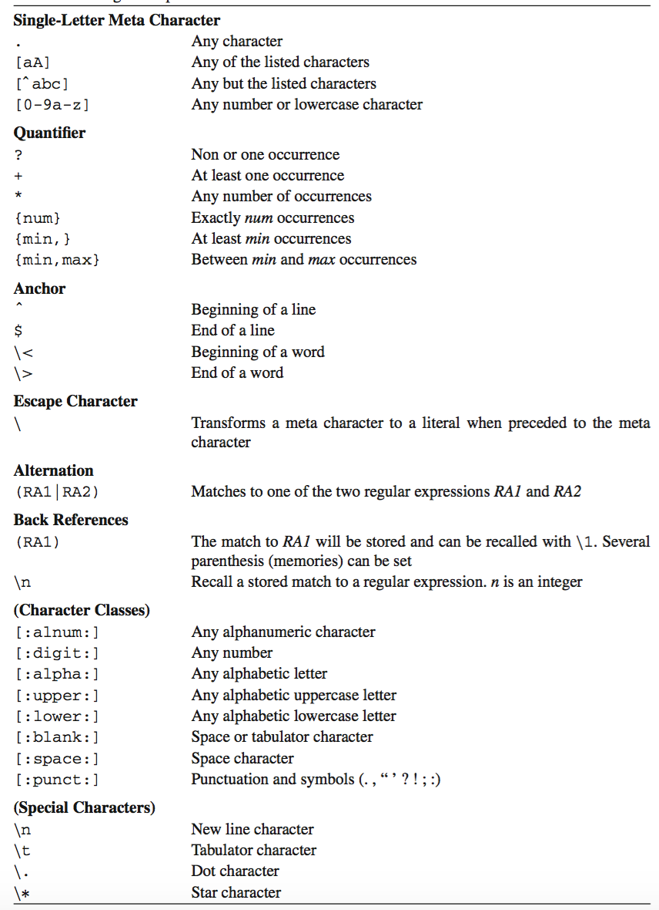

# Regular Expressions

## Başlarken...

Bu bölümde kullanılacak olan terimler aşağıda açıklanmıştır.

Literal

 : Literal, aramada kullanılan karakterin gerçek anlamıdır. Örneğin; Linux içindeki inu karakteri. inu literal bir dizidir. Her karakter aramada rol alır ve dizi tam olarak yazıldığı şekilde eşlenir.

Meta Karakter

 : Meta karakterler özel anlamları olan, yazıldığı şekilde eşlenmeyen bir ya da daha fazla özel karakterlerdir. Örneğin; nokta karakteri "." bir meta karakterdir.

Escape Sequence

 : Escape sequence bir meta karakterin literal yani yazıldığı şekilde eşlenmesini sağlar. Regular expression da escape sequence için meta karakterin önüne ters eğik çizgi (\\) yazılmalıdır. Nokta karakterini bulmak için "\\." şeklinde aratılmalıdır.

Target String

 : Hedef dizisi arama yapılması istenilen karakterlerdir. Yani kaynak dosyada eşleme istenilen dizidir.

Search Pattern

 : Arama paterni ya da yapı; hedef diziyi bulmak için yapılmış olan tanımlamadır. 

 Regular expression özel bir arama paterni (search pattern) için seçilmiş bir dizi karakterdir. Metin içerisinde aranmak istenilen bir hedef dizisine (target string) ulaşmak için kullanılır. Neredeyse tüm metin editörlerinde (Microsoft Word gibi) bu özellik vardır. Regular expression lar diğer basit sorgulamalardan farklı olarak belirli paternlerinde aratılmasında kullanılabilir. Belirli uzunluktaki kelimeler ya da bir kelime içinde tekrar eden üç adet ts kelimesi gibi farklı paternlerde aramalar gerçekleştirilebilir. Regular expression lar her zaman bir program ile birlikte kullanılmalıdır. Patern arama ve paterni içeren satırları ekrana basmak için `"egrep"` kullanılır.  

 {title="Tablo ",width="100%"}
| Arama Paterni  | Hedef Dizi      														|
|:--------------:|:--------------------------------------------------------------------:|
| `(DNA|RNA)`    | "DNA" ya da "RNA" aranır.       										|
| `(D|R)NA`      | "DNA" ya da "RNA" aranır.   											|
| `[tmr]RNA`     | "tRNA", "mRNA" ya da "rRNA" aranır.                                  |
| `*omics`       | "Genomics", "Proteomics" ya da bir diğer "nomics" aranır.            |
| `b.g`          | "b" ve "g" arasındaki herhangi karakterle eşleşir. Ör; big,bug,bag...|
| `[a-zA-Z]`     | Herhangi küçük ya da büyük harfli karakterle eşleşir.                |
| `[^a-zA-Z0-9]` | Rakam ya da harf olmayan herhangi bir karakterle eşleşir.            |
| `^ [eE]nzyme`  | Satır başındaki "Enzyme" ya da "enzyme" kelimesiyle eşleşir.         |
| `[eE]nzyme$`   | Satır sonundaki "Enzyme" ya da "enzyme" kelimesiyle eşleşir.         |

## Regular Expression ların kullanımı

Regular expression lar tek başlarına çalışamazlar. Bir komut ya da programlama dili ile birlikte kullanılmalıdır. Örneğin; `grep`, `find`, `vi`, `sed`, `awk`, `perl`, *MySQL*, *JavaScript*, *Java*, *PHP*, vb. Eğer `grep` komutu kullanılacak ise mutlaka `-e` opsiyonu ile kullanılmalıdır. Bunun yerine `egrep` komutu direk olarak kullanılabilir.

> `grep -e` komutu yerine `grep -E`(regular expression lar için genişletilmiş) komutu kullanıldığında meta karakterlerin (? + | ( ) { }) maskelenmesi gerekmez.

Aşağıda protein-yapisi.pdb dosyasından alınmış bir kısım gösterilmektedir. Dosya *Brookhaven Protein Data Bank*dan *1CFZ* proteinin kristal yapısını tanımlayan dosyanın kısaltılmış halidir. Dosyanın tamamına [RCSB](http://www.rcsb.org/pdb) adresinden ulaşılabilir.

<<[Şekil ](code/file4.txt)

Dosyanın içeriğinde bir proteinin kristal yapısının bilgisi detaylı olarak verilmiştir. Bir protein üç önemli özellikle karakterize edilir: aminoasit dizisi (birincil yapı), α-heliks ve β-tabakalarının varlığı (ikincil yapı) ve üç-boyutlu (3D) yapı (üçüncül yapı).X-ray ve NMR sprektroskopisi gibi metodlarla proteinin üçüncül yapısı tayin edilebilir. 

Bir proteinin tüm yapısal özellikleri *Brookhaven Protein Data Bank File Format* adında özel bir dosya formatında saklanır. protein-yapisi.pdb dosyasının ilk 5 satırı dosya hakkında bazı bilgileri içerir, sonraki 4 satır protein dizisini, takip eden satırlarda (10-15. satırlar) ikincil yapısını ve atomların pozisyonlarını içerir. 

## Patern arama ve örnekleri

Bu bölümde farklı tiplerdeki regular expressionlar ve onların nasıl uygulanacağı anlatılacaktır. Regular expressions anlamak için `grep` (ya da `egrep`) komutu üzerinden gidilebilir. `grep` input dosyasında özel bir patern aramak için kullanılır ve ekranda aranan paterni görüntüler. `grep` komutunun aksine `egrep` komutu ile yapılan patern arama sonucu regular expression içerebilir. Aranacak patern mutlaka tırnak ('...') içinde aratılmalıdır. 
 
### Single-Character Meta Characters

Bir aminoasitin en temel gösterimi onun üç harfli gösterimidir. Örneğin bir aminoasit olan glisin GLY ile, glutamin GLN ile gösterilir. Bu iki aminoasitin gösteriminin birbirlerinden tek farkı bir harftir. Bu çeşit farklılıkları araştırmanın birçok yolu vardır. Tek karakter farklılıklarından yola çıkılarak yapılan aramalara single-character meta characters denir. Bunlar aşağıdaki sembolleri içerir;

`.`

 : Yeni satırdaki karakter dışında tüm karakterlerle eşleşir.

`[]`

 : Köşeli parantez içinde yazılı olan karakterlerle eşleşir. Örneğin `[acgt]` şeklinde yapılan bir arama sonucu "a", "c", "g" ya da "t" içeren satırlar ekrana basılır. 

`[^]` 

 : Köşeli parantez içinde yazılı olan karakterler dışındaki tüm karakterlerle eşleşir.

`[0-9]`

 : 0 ile 9 arasındaki tüm rakamlarla eşleşir. Kısa çizgi (-) karakteri sayı aralığını tanımlar. Örneğin `[0-3a-cz]` araması `[0123abcz]`` aramasına denktir.

Meta karakterlerin regular expression aramasında nasıl kullanılacağı aşağıda açıklanmıştır. protein-yapisi.pdb dosyasından GLU ve GLN içeren satırları görüntülemek istenirse aşağıdaki komutlar girilmelidir.

{#regexilk}
<<[Şekil ](code/terminal73.txt) 

%%%% TOFIX crosslink çalışmıyor ve kod sayfada görünmüyor

Yukarıdaki örnekte ilk yapılan aramada "GL." regular expression aranmıştır. protein-yapisi.pdb dosyasındaki G ve L karakterinden sonra gelen herhangi bir karakter (.) içeren tüm satırlar ekrana basılmıştır. Ardından yapılan iki aramada sırasıyla GLN ve GLY aminoasitlerini içeren satırlar aranmıştır.

> Yukarıdaki şekilde yapılan arama sonucu çıktısının tamamı görüntülenmemiştir. Örnek olması açısından bir kısmı seçilerek sunulmuştur.

Treonin ve tirozin aminoasitlerini aramak için girilmesi gereken komut;

> `egrep 'T.R' protein-yapisi.pdb`

Alanin ve glisin aminoasitleri arasında kalan tüm aminoasitleri içeren satırları görüntülemek için girilmesi gereken komut;

> `egrep 'ALA.....GLY' protein-yapisi.pdb`

Yukarıdaki komutta girilen beş nokta ardışık herhangi beş karakteri temsil eder (boşluk karakteri de dahil).  Aynı patern araması aşağıdaki şekilde de gerçekleştirilebilir.

> `egrep 'ALA ... GLY' protein-yapisi.pdb`

Bu örnekte boşluk karakterinin normal bir karakter olarak davrandığı gösterilmiştir.

<<[Şekil ](code/terminal73_1.txt)

Köşeli parantez ile yapılan aramada parantez içerisindeki karakterlerden herhangi birini içeren satırlar ekrana basılır. protein-yapisi.pdb dosyasında GL ile başlayan üç adet aminoasit bulunmaktadır; glisin(GLY), glutamin(GLN), glutamik asid(GLU). Bunların arasından GLU ya da GLY içeren aminoasitleri ekranda görüntülemek için;

<<[Şekil ](code/terminal74.txt)

Köşeli parantez içerisindeki `[YU]` GL karakterlerinden sonra ya Y ya da U karakterinin gelmesi gerektiği anlamına gelir. Arama yapılırken kısa çizgi (-) de kullanılabilir.

<<[Şekil ](code/terminal75.txt)

`[0-2T] A` araması 0,1,2 ya da T ve ardından gelen bir boşluk karakteri ve ardından A harfinin geldiği bir aramadır. Aramanın tam tersini yapmak için yani bu karakterler dışında kalanları aramak için;

> `egrep '[^0-2T] A' protein-yapisi.pdb`

komutu girilerek `[0-2T] A` paternini içermeyen satırlar görüntülenebilir.

### Quantifiers

?

 : Önce gelen karakterle eşleşir ve o karakterin 0 ya da bir kere tekrarını listeler.

\*

 : Önce gelen karakterle eşleşir ve o karakterin 0 ya da daha çok kez tekrarını listeler.

\+

 : Önce gelen karakterle eşleşir ve o karakterin bir ya da daha çok kez tekrarını listeler.

\{num}

 : Önce gelen karakterle eşleşir ve o karakteri num sayısı kadar listeler.

\{num,}

 : Önce gelen karakterle eşleşir ve o karakteri en az num sayısı kadar listeler.

\{min,max}

 : Önce gelen karakterle eşleşir ve o karakteri en az min kadar en çok max sayısı kadar listeler. Rakamlar 65536dan küçük olmalıdır ve ilk rakam ikincisine eşit ya da küçük olmalıdır.

Quantifier lar tek başlarına kullanılamazlar. Kendinden önceki ya da meta karakterle birlikte kullanılması gerekmektedir. 

Bu kısımda yapılacak olan örnekler için sequence.dna dosyası kullanılmıştır. sequence.dna dosyasında iki adet rastgele sıralanmış FASTA formatında DNA dizisi bulunmaktadır. Dizi isimleri ">" karakterinden sonra belirtilmiştir. 

<<[Şekil ](code/file5.txt)

Dizi isimlerini içeren satırları görüntülemek için;

> `egrep '>' sequence.dna` 

komutu girilmelidir.

Dosyada start kodonuyla (ATG) başlayıp herhangi nükleotitlerden sonra stop kodonu (TAA) ile biten satırları görüntülemek için girilmesi gereken komut;

> `egrep 'ATG.*TAA' sequence.dna`

Bir diğer regular expression örneğinde iki ya da üç ama daha fazla olmayan ardışık olarak gelen A lar için girilmesi gereken komut;

> `egrep '[CGT]AAA?[CGT]' sequence.dna`

Soru işareti ondan önce gelen karakter olan A'nın bir ya da hiç görülmediği patern aramasıdır. Baştaki `[CGT]` ve sondaki regular expression, ardışık üçten fazla A'nın görüntülenmesine engel olur. Bu komut aynı zamanda `[^A]` şeklinde de yazılabilir.  

> `egrep '[^A]AAA?[^A]' sequence.dna`

İki ya da daha fazla tekrar eden Alar görüntülenmek isteniyorsa girilmesi gereken komut;

> `egrep '[^A]AA+[^A]' sequence.dna`

Artı işareti ondan önce gelen karakter olan A'nın en azından bir kez görüldüğü patern aramasıdır. Kaşlı parantez ({}) içine yazılan rakam istenilen tekrar sayısıdır. Örneğin 4 ya da daha fazla A'nın tekrar ettiği yerler aranmak isteniyorsa girilmesi gereken komut;

> `egrep 'A{4,}' sequence.dna`

Yukarıda verilen örneklerde de görülebileceği üzere regular expression lar oldukça güçlü bir patern arama aracıdır.

### Gruplandırma

Genellikle belirli bir paterni gruplandırmak arama yaparken oldukça yardımcı olacaktır. Parantez "()" içine alınarak arama yapılır. AT dizisinin tekrarlarını görüntülemek için girilmesi gereken komut;

> `egrep 'AT(AT)+' sequence.dna`

> Tırnak içinde yazılan ilk AT silinirse AT dizisinin bir kez görüldüğü kısımlarda görüntülenecektir ve bu koşulda tekrar motifi dışındakilerde görüntülenmiş olur. Bunun önüne geçmek için ilk olarak AT yazılmalıdır.

protein-yapisi.pdb dosyasındaki tekrar eden glisinleri görüntülemek için girilmesi gereken komut;

> `egrep '(GLY ){2,}' protein-yapisi.pdb`

> GLY den sonra bir boşluk karakteri olduğuna dikkat ediniz. Dosyadaki aminoasitler birbirlerinden boşluk karakteriyle ayrıldıkları için patern arama yaparken boşluk karakterinin de kullanılmasına özen gösterilmelidir.

### Anchors

Genellikle patern arama yapılırken paternin konumununda belirtilmesi gerekmektedir. Bu şekilde yapılan aramalara anchoring patern denir.

\^

 : Satır başıyla eşleşir.

$

 : Satır sonuyla eşleşir.

\\<

 : Kelimenin başlangıcıyla eşleşir.

\\>

 : Kelimenin sonuyla eşleşir.

\b

 : Kelimenin başlangıcı ya da bitişiyle eşleşir.

\\B

 : Kelimenin başlangıcında ya da sonunda olmayan karakterle eşleşir.

protein-yapisi.pdb dosyasında H karakteri ile başlayan tüm satırları bulmak için girilmesi gereken komut;

> `egrep '^H' protein-yapisi.pdb`

Boş satırları görüntülemek için girilmesi gereken komut;

> `egrep '^$' protein-yapisi.pdb`

Eğer tüm boş satırlar ve yalnızca boşluk tuşu içeren satırlar görüntülenmek isteniyorsa girilmesi gereken komut;

> `egrep '^ *$' dosyaadi`

Yukarıdaki komutla ekranda yalnızca boş satırlar görüntülenir. Tüm boş olmayan satırlar görüntülenmek isteniyorsa girilmesi gereken komut;

> `egrep '^ ' dosyaadi`

Boş satırlar ya da yalnızca boşluk karakteri içeren satırlar bu regular expression la eşlenmez. 

Regular expression lar `ls` komutunun çıktısının formatını belirlemeyi de sağlar. 

> `ls -l | egrep '^d'`

`egrep` komutu aranan dosyanın ilk karakterinin "d" olup olmadığına bakar. Aynı şekilde aranan dosyanın okunabilir ya da yazılabilir olma durumu içinde arama yapılabilir.

> `ls -l | egrep '^.{7}rw'`

Üstteki komutta yapılan aramada satırların 8. ve 9. karakterlerin "r" ve "w" oluşuna bakılmıştır.

### Escape Sequences

Arama yaparken özel karakterleri karakter olarak aramak yani farklı anlamlara gelmeden yazıldığı şekilde arama yapabilmek için özel işaretlerin önüne ters eğik çizgi (\\) koyulmalıdır. Ters eğik çizgiden sonra yazılan herhangi bir özel karakter (nokta, yıldız işareti, eğik çizgi, vb.) karakterin kendisi için yapılmış olan aramayı temsil eder.

.*[\

 : Nokta, yıldız işareti, sol köşeli parantez ve ters eğik çizgi köşeli parantez ([]) içine yazılmadığında özeldir. 

\^ 

 : Düzeltme ya da uzatma imi regular expression başlangıcında ya da köşeli parantez ([]) çiftinin içinde (sol köşeli parantezden hemen sonra) kullanıldığında özeldir. 

$

 : Dolar işareti regular expression ın sonunda kullanıldığında özeldir.

### Alternation

Alternation mantıksal olan OR yerine "|" karakterinin kullanılmasıdır. Genellikle alternation için arama yapılırken alternatif aramaların kapsamı parantez içinde belirtilmelidir. Aşağıdaki komutta GLY ve GLN aminoasitleri tek bir komutta aranmıştır;

> `egrep '(GLY|GLN)' protein-yapisi.pdb` 

Bu arama sonucu ekrana gelen çıktı ile !!! [ilk şekilde](#regexilk) görülen çıktı aynıdır. Arama yapılması istenilen aminoasitlere göre örnekler arttırılabilir.

> `egrep '(GLY|GLN|ILE)' protein-yapisi.pdb`  

Birden fazla expression araması yapılırken dikkat edilmesi gereken bir husus vardır. "bir ve|veya iki" ile "(bir ve)|(veya iki)" ifadeleri birbirleriyle aynıdır fakat "bir (ve|veya) iki" ile eşit değildir. Arama yapılırken parantez kullanılması daima daha güvenlidir.

### Back References

()

 : Kapalı parantez içerisindeki regular expression aramasını hafızada tutar.

\n

 : n\. yapılan aramayı yeniden gösterir. Kapalı parantez içerisinde yapılmış olan ilk yapı \1, ikinci yapı \2 vb. şeklinde gösterilir.

Her satırdaki tekrarlayan karakterlerin bulunması istendiğinde izlenmesi gereken yol;

<<[Şekil ](code/terminal76.txt)

`[A-Za-z]` yapısı kapalı parantez içerisinde yapılan arama ile herhangi bir alfabetik karakterin küçük ya da büyük harfli oluşu farketmeksizin yapılmış olan aramadır. Yapılmış olan bu aramanın ardından aynı aramayı yeniden görüntülemek için "\1" yazılmalıdır.

sequence.dna dosyasındaki duplet DNA tekrar bölgelerini bulmak için girilmesi gereken komut;

<<[Şekil ](code/terminal77.txt)

Yukarıdaki terminaldeki örnekte DNA'da tekrar eden nükleotitler aranmıştır. Çıktının ilk satırında tekrar "GGGGGG" olarak görülürken ikinci satırdaki "GTGTGT" ve "ATATAT" DNAdaki tekrarlardır. DNAdaki triplet tekrarları bulmak için girilmesi gereken komut;

> `egrep '([ACTG])([ACTG])([ACTG])\3\2\1' dosyaismi`

Yukarıdaki komut çıktısında "TCAACT", "GCGGCG" ya da "AAAAAA" gibi tekrarlar görülebilir. Aynı çıktıyı elde etmek için aşağıdaki komut girilemez.

> `egrep '([ACTG]){3}\3\2\1' dosyaismi`

Yukarıdaki komut girildiğinde "bad back reference" erroru ile karşılaşılır. Bunun nedeni oradaki parantezlerin gerçekte yer almasıdır. Quantifier ile tekrar sağlanamaz.

### Priorities

{title="Tablo Regular expression karakterlerinin sınıflandırılması",width="95%"}
| Patern       | Hedef      														            |
|:------------:|:-------------------------------------------------------------------------------|
| `[:alnum:]`  | 0'dan 9'a ya da A'dan Z'ye ya da a'dan z'ye herhangi bir alfanümerik karakter. |
| `[:digit:]`  | 0'dan 9'a olan sayılar.   														|
| `[:alpha:]`  | A'dan Z'ye ya da a'dan z'ye herhangi bir alfa karakter.             			|
| `[:upper:]`  | A'dan Z'ye herhangi bir alfa karakter.           								|
| `[:lower:]`  | a'dan z'ye herhangi bir alfa karakter.											|
| `[:blank:]`  | Yalnızca boşluk ve tab karakteri. 								                |
| `[:space:]`  | Herhangi bir boşluk karakteri.										            |
| `[:punct:]`  | Noktalama karakterleri .,"'?!;:									            |
| `[:print:]`  | Herhangi bir yazdırılabilir karakter.								            |

Aynı parantez levelinde operatörlerin öncelik sıralaması; ; *,+,? ; birleştirme (concatenation); | (alternation); yeni satır karakteri. Parantezler her zaman en yüksek önceliğe sahiptirler. Bu nedenle emin olunamadığı durumlarda parantez kullanılmalıdır. 

### Özet

## Genom Araştırmalarında Regular Expression

Bir nükleotitte ya da aminoasit dizisi içinde spesifik bir paterni aramak için birçok yol mevcuttur. Bu yollardan biri olan regular expression oldukça önemlidir. Bu konuda verilebilecek örneklerden biri transkripsiyon bağlanma bölgesi faktörüdür. NtcA (nitrojen kontrol faktör A) proteini bazı bakterilerde nitrojen asimilasyonunu sağlar. NtcA proteini için bulunan DNA bağlanma bölgeleri deneysel olarak onaylanmıştır: {$$}TGTN_{9}ACA{/$$} ve {$$}TGTN_{10}ACA{/$$}. Burada N herhangi bir nükleotidi temsil eder. 

> `egrep 'TGT.{9,10}ACA' genom.dosya`

Yukarıdaki komut girilerek bu patern aratılır ve istenilen paterni içeren tüm satırlar ekranda görüntülenir. `-c` opsiyonu ile eşleşen satır sayısı öğrenilir. Bunun için girilmesi gereken komut;

> `egrep -o 'TGT.{9,10}ACA' genom.dosya | wc -l`

eşleşen patern sayısını öğrenmek için girilmesi gereken komut;

> `egrep -c 'TGT.{9,10}ACA' genom.dosya | wc -l`

Günümüzde patern analizi oldukça yaygın olarak araştırılmaktadır. Bu alanda geliştirilmiş olan programlardan bazıları; `agrep` mutasyon araştırmalarını sağlayan bir programdır (Wu and Manber 1992), `tacg` moleküler biyologlar için özel olarak tasarlanmış ve optimize edilmiş bir DNA-dizi patern arama programıdır (Mangalam 2002). En çok kullanılan veritabanlarından olan [PROSITE]( http://www.expasy.org/prosite/) (protein domainleri, aileleri ve fonksiyonel bölgelerini içeren veritabanı ) aminoasit paternlerinin regular expression lar ile tanımlanmasına dayanır (Sigrist et al.2002). PROSITE ile yapılan klasik bir patern araması aşağıdaki şekilde görülür.

> `C-G-G-x(4,7)-G-x(3)-C-x(5)-C-x(3,5)-[NHG]-x-[FYWM]−x(2)-{GP}-C`

Burada her harf bir aminoasiti temsil eder. "x" herhangi bir aminoasit anlamına gelir. Bu bağlamda yukarıdaki örneğin tripeptid sistein-glisin-glisin ile başladığı görülür. Eksi işaretinin herhangi bir anlamı yoktur. "x(4,7)" herhangi bir aminoasitin 4 ila 7 kez rastgele geldiğini temsil eder. Bunun yerine {4,7} şeklinde de yazılabilir. `[NHG]` bu üç aminoasit dışındaki herhangi bir aminoasit anlamına gelir.

>### Sorular
>* Üç boşlukla ayrılmış alanları (kelimeler) içeren satırları bulunuz.
>* Negatif tamsayı ile eşleşen bir arama paterni bulunuz.
>* Kenarlarında boşluk olan herhangi bir ondalık sayı (pozitif ya da negatif) ile eşlenen arama paterni dizayn ediniz.
>* Başlangıç kodonu olan ATG ile başlayan ve bitiş kodonu olan TAA ile sonlanan bir nükleotit dizi paterni bulunuz. Dizi en az 20 nükleotit uzunluğunda olmalıdır.
>* "hydrogenase" kelimesini içeren ve "dehydrogenase" kelimesini içermeyen tüm satırları bulunuz.
>* İntronların sınıfları kesin olarak dizilerine göre tanımlanabilir.  Konsensus dizisi "GT...TACTAAC...AG" olan bir intron için (üç noktalar bilinmeyen sayıdaki nükleotiti temsil eder) bu hedefle eşlenecek arama paterni yazınız.
>* Bir grup proteinin konsensus dizisi: G(R/T)VQGV GFRx13G(D/W)V(C/N)Nx3G. Burada (R/T) R ya da T, x13 13 adet spesifik olmayan aminoasiti temsil eder. Her bir harf bir aminoasiti temsil eder. Bu hedefle eşlenecek regular expression dizayn ediniz.
>* Home klasörünüzde tüm kullanıcılar için okunabilir (readable) olan dosyaları listeleyiniz. Aynı işlemi home klasörünüzde tüm altdizinler için tekrarlayınız.
